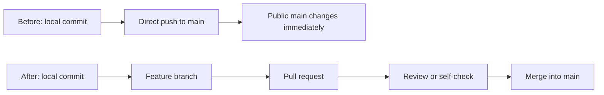
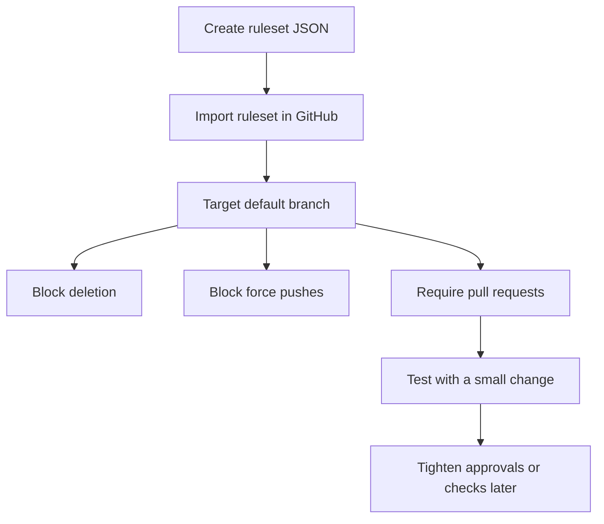
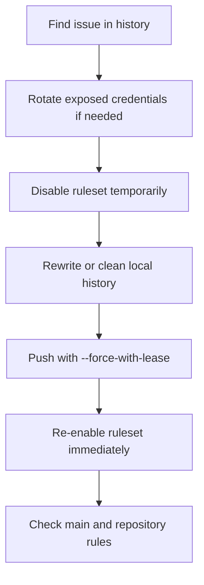

# A Sane Default GitHub Ruleset for Protecting Main

You make a repository public, tidy up the README, remove the private bits, and feel reasonably pleased with yourself. Then a horrible thought appears: **can I still just push directly to `main` from my laptop at 11:43pm?**

By default, yes, quite possibly.

That might be fine whilst a repo is private and you are still moving quickly. Once it is public, though, `main` should stop being a casual dumping ground. A typo in a workflow file, an accidental commit, or a rushed force push can turn a neat little project into a public archaeology site.

I hit this recently whilst cleaning up a small real-world project before publishing it. I had moved private data out of the repository, squashed some history, and then realised the protection story was still a bit too “good luck and vibes” for my liking.

This post covers a practical GitHub ruleset you can import to protect your default branch, why I prefer rulesets over older branch protection rules for new setups, and which options I would turn on for a small public project.

## Rulesets, Not Old Branch Protection Rules

GitHub still has classic branch protection rules, and they are not suddenly useless. Plenty of repositories use them perfectly well.

For new repositories, though, I would start with **rulesets**. GitHub rulesets give you a named set of rules, a clear enforcement status, and a reusable JSON export/import workflow. That last bit matters if you have a handful of small projects and do not want to click the same settings into place every time.

The main practical difference is visibility and reuse. A ruleset describes what GitHub should allow on matching branches or tags, and anyone with read access can see active rulesets for the repository. That makes it easier to understand why a push or merge failed without needing admin access.

GitHub’s own docs also note that rulesets can work alongside classic branch protection rules, and when multiple rules apply, GitHub combines them with the most restrictive result. That is useful, but it also means you should avoid creating overlapping mystery rules unless you enjoy debugging policy by candlelight.

For a small public repo, I want one obvious rule: protect the default branch. Keep it boring. Boring is excellent here.



## The Default I Would Actually Use

For a small project, my starting point is:

| Setting | Default | Why |
| --- | --- | --- |
| Target | Default branch | Protects `main` or whatever your default branch is called |
| Block deletions | On | Stops accidental branch removal |
| Block force pushes | On | Prevents history rewrites on `main` |
| Require pull request | On | Stops direct pushes |
| Required approvals | `0` | Keeps solo projects usable |
| Required status checks | Off initially | Avoids blocking yourself with flaky CI |

That last row may look odd. Surely required checks are good?

They are, once your CI is stable. If your workflow names are still changing, or your builds fail because the runner image sneezed, required status checks can become friction rather than protection. I prefer adding them once the pipeline has proved itself for a week or two.

For a solo repository, I also tend to set required approvals to `0`. That still forces changes through a pull request, which gives you a visible review point, a diff, and a chance to pause. It just does not require you to approve your own work with a second account, which is security theatre wearing a tiny hat.

If you have another maintainer, set required approvals to `1`. If you have a team, you probably also want code owners, required review thread resolution, and required status checks. This post is deliberately aimed at the smaller end of the scale.

## Importable Ruleset JSON

Create a file called something like `protect-main.ruleset.json` and paste this in:

```json
{
  "name": "Protect default branch",
  "target": "branch",
  "enforcement": "active",
  "conditions": {
    "ref_name": {
      "include": [
        "~DEFAULT_BRANCH"
      ],
      "exclude": []
    }
  },
  "rules": [
    {
      "type": "deletion"
    },
    {
      "type": "non_fast_forward"
    },
    {
      "type": "pull_request",
      "parameters": {
        "required_approving_review_count": 0,
        "dismiss_stale_reviews_on_push": true,
        "require_code_owner_review": false,
        "require_last_push_approval": false,
        "required_review_thread_resolution": false,
        "allowed_merge_methods": [
          "merge",
          "squash",
          "rebase"
        ]
      }
    }
  ],
  "bypass_actors": []
}
```

To import it in GitHub:

1. Go to your repository.
2. Open **Settings**.
3. Go to **Rules** then **Rulesets**.
4. Choose **New ruleset** then **Import a ruleset**.
5. Select the JSON file.
6. Review the imported settings before creating it.

The important bit is `~DEFAULT_BRANCH`. That means the ruleset follows your repository’s default branch rather than hard-coding `refs/heads/main`. If you rename `main` later, the ruleset still targets the right place.

The `pull_request` rule blocks direct updates to the target branch by requiring changes to arrive through a pull request. The `deletion` rule stops the branch being deleted, and `non_fast_forward` blocks force pushes.



## When To Require Approvals

Required approvals are useful when another human can genuinely review the change. They are less useful when you are the only maintainer and the rule just adds admin faff.

For a solo public repository, I like this pattern:

1. Require pull requests.
2. Set approvals to `0`.
3. Use the PR as a deliberate checkpoint.
4. Add `1` approval later if another maintainer joins.

This still stops casual direct pushes. It also gives you a place for GitHub Actions, Dependabot updates, notes to yourself, and a visible trail of what changed.

For a shared repository, use at least one approval. If the repo deploys infrastructure, handles customer data, or publishes packages, I would also require review thread resolution and consider code owners for sensitive paths.

The gotcha is that approval settings can become annoying quickly if you apply them too early. I have seen small repos end up with protection so tight that every tiny documentation fix becomes a ceremony. That usually leads to someone disabling the ruleset, doing the work, and forgetting to turn it back on.

That is worse than a simpler rule people actually keep enabled.

## Be Careful With Required Status Checks

Required status checks are excellent when your CI is predictable. They are miserable when your workflows are still settling down.

Do not require a check until you know its exact name and trust it to run consistently. GitHub requires named checks, and if you rename a workflow job, split a workflow, or change how your CI reports status, you can block merges by accident.

A sensible path looks like this:

```yaml
name: build

on:
  pull_request:
    branches:
      - main

jobs:
  build:
    runs-on: ubuntu-latest

    steps:
      - uses: actions/checkout@v4

      - name: Run tests
        run: npm test
```

Let that run on a few pull requests first. Once it behaves, add the check to the ruleset as a required status check.

For small projects, I normally wait until the build has stopped changing. There is no prize for making a flaky workflow mandatory.

You can inspect branch and PR state with the GitHub CLI if you use it:

```bash
gh pr status
gh branch --list
```

Those commands are not required for the ruleset, but they are handy when you are checking whether your workflow is doing what you think it is doing.

## Temporarily Disabling Rules For History Cleanup

Sometimes you need to rewrite history before publishing a repository. Maybe you committed sample data that was not sample enough. Maybe you want to squash noisy early commits before making the repo public.

The safe flow is:



The key phrase is **temporarily**. Disable the ruleset, do the rewrite, then re-enable it before you move on.

If you need to force push, use `--force-with-lease`, not plain `--force`:

```bash
git push origin main --force-with-lease
```

That gives Git a chance to stop if the remote branch has moved since you last fetched. It is not magic armour, but it is a better default than overwriting whatever is on the remote without checking.

One important security point: if secrets were ever committed, rewriting history is not enough. Rotate the credentials. Treat the old values as exposed, because they were.

## Common Mistakes

Do not protect `main` but still allow force pushes. If history can be rewritten casually, your protection has a fairly large hole in it.

Do not require approvals on a solo repo unless you have a genuine review path. Require pull requests first, then add approvals when another maintainer can help.

Do not turn on required status checks before your CI has settled. Let the checks run for a while, confirm the names, then make them mandatory.

Do not disable a ruleset for a one-off fix and leave it disabled. If you need to bypass protection, make that a small, deliberate window of time.

Do not assume squashing history fixes leaked secrets. Rotate keys, tokens, passwords, and connection strings before you worry about making the commit graph pretty.

## Summary

Protecting `main` is not just an enterprise governance exercise. For a small public repository, it is basic damage control.

A good default ruleset blocks direct pushes, branch deletion, and force pushes. It requires pull requests, but it does not make solo maintenance awkward by demanding approvals that cannot happen sensibly.

Add stricter controls when the repository earns them. Required approvals, code owners, and status checks are all useful, but they work best when they match how the project actually runs.

My rule of thumb is simple: make the risky path difficult, keep the normal path pleasant, and avoid clever policy you will be tempted to disable later.

## What To Explore Next

- Read GitHub’s documentation on [about rulesets](https://docs.github.com/en/repositories/configuring-branches-and-merges-in-your-repository/managing-rulesets/about-rulesets) and [available rules](https://docs.github.com/en/repositories/configuring-branches-and-merges-in-your-repository/managing-rulesets/available-rules-for-rulesets).
- Pair this with **Cleaning Git History Before Making a Repository Public** if you are tidying an existing repo.
- Add CI carefully with **GitHub Actions for Azure Deployments** once your workflow is stable.
- Copy the JSON above, adapt it for your own repositories, and connect with me on LinkedIn if you want to compare notes.