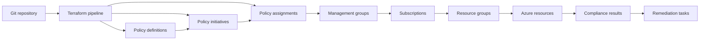
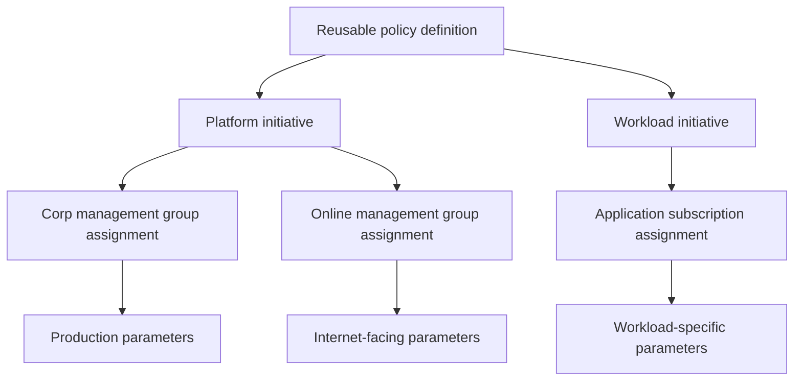
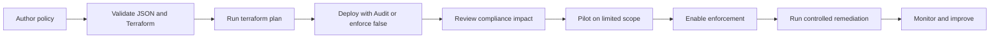
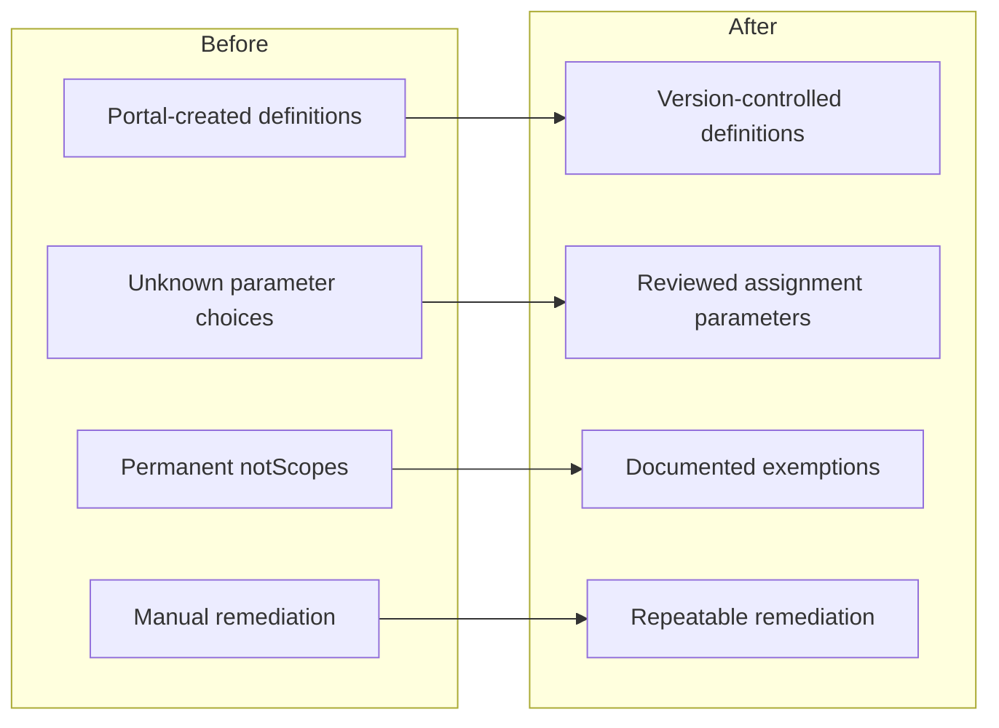

You have agreed the governance standards, written several Azure Policy definitions and manually assigned them through the portal. Everything looks fine until somebody needs to reproduce the configuration in another tenant.

Nobody can quite remember which parameters they selected, why one subscription sits in `notScopes`, or whether the assignment’s managed identity received the correct role. The portal shows the current state, but it does not explain the decisions that created it.

This is where Terraform earns its place.

Managing Azure Policy through Terraform gives you version control, peer review and a repeatable deployment process. It also exposes several awkward details that the portal politely handles on your behalf, particularly assignment scope, JSON structures, managed identities and remediation permissions.

I have seen Azure Policy deployments fail despite producing a perfectly clean Terraform plan. The code deployed, the compliance dashboard populated, and absolutely nothing got remediated because the policy identity had no permissions.

This article covers how I structure policy definitions, initiatives and assignments, how I handle remediation safely, and how I deploy changes without turning production into the testing environment.



## Treat definitions, initiatives and assignments separately

The first mistake I regularly see is a Terraform structure that treats every Azure Policy object as the same thing.

They are related, but they solve different problems:

| Object            | Purpose                                       |
| ----------------- | --------------------------------------------- |
| Policy definition | Describes the condition and effect            |
| Initiative        | Groups related policy definitions             |
| Assignment        | Applies a definition or initiative to a scope |
| Exemption         | Records an approved exception                 |
| Remediation task  | Corrects existing non-compliant resources     |

A policy definition does nothing until you assign it. An initiative, also called a policy set, lets you manage several related definitions through one assignment and share parameters between them. Azure supports assignments at scopes including management groups, subscriptions, resource groups and individual resources.

I normally separate the Terraform into three layers:

```text
policy/
├── definitions/
├── initiatives/
└── assignments/
```

The definitions layer owns reusable policy logic. The initiatives layer groups those controls into outcomes such as platform security, diagnostic settings or tagging governance.

The assignments layer contains environment-specific decisions: where the initiative applies, which parameter values it uses and which scopes require exclusions.

This separation matters in an enterprise Azure Landing Zone. You may use the same policy definition across development and production whilst assigning different effects or allowed values.



Do not copy the same definition merely because two assignments need different values. Parameterise the behaviour instead. Azure Policy parameters exist specifically to let one definition support different requirements at assignment time.

## Build policy definitions with `jsonencode`

Azure Policy definitions use JSON, but that does not mean you should maintain large JSON heredocs inside Terraform.

Heredocs work until you introduce parameters, escaping and conditional content. Then you spend an afternoon debugging punctuation, which is not why any of us got into cloud architecture.

I prefer building native HCL objects and passing them through `jsonencode`. HashiCorp documents `jsonencode` as the function for converting Terraform values into JSON syntax.

This example creates a policy that audits resources without an `Environment` tag:

```hcl
variable "policy_definition_management_group_id" {
  type        = string
  description = "Resource ID of the management group that owns the definition."
}

resource "azurerm_policy_definition" "require_environment_tag" {
  name                = "audit-required-environment-tag"
  display_name        = "Resources should have an Environment tag"
  description         = "Audits resources that do not contain the required Environment tag."
  policy_type         = "Custom"
  mode                = "Indexed"
  management_group_id = var.policy_definition_management_group_id

  metadata = jsonencode({
    category = "Tagging"
    version  = "1.0.0"
  })

  parameters = jsonencode({
    effect = {
      type = "String"

      metadata = {
        displayName = "Effect"
        description = "Controls whether the policy audits resources or remains disabled."
      }

      allowedValues = [
        "Audit",
        "Disabled"
      ]

      defaultValue = "Audit"
    }
  })

  policy_rule = jsonencode({
    if = {
      field  = "tags['Environment']"
      exists = "false"
    }

    then = {
      effect = "[parameters('effect')]"
    }
  })
}
```

The definition lives at a management group so Azure can assign it to that management group or scopes below it. Definitions created at subscription scope cannot apply outside that subscription, so choose the definition location based on where you expect to reuse it.

I have used `Indexed` because this policy evaluates a tag on resources. Microsoft recommends `all` in most cases, but `Indexed` avoids evaluating resource types that do not support tags or location. Policies targeting subscriptions or resource groups need more deliberate handling because those scopes behave differently.

Also give your custom definitions a version in their metadata. Azure will not version your custom policy logic for you in the same way your Git repository does, but recording the version makes compliance investigations and release notes considerably clearer.

## Group policies into meaningful initiatives

Assigning dozens of individual policies creates dozens of parameter sets, exclusions and deployment objects. It also makes it harder to explain the intended outcome.

Initiatives let you group related definitions and assign them as one governance control. The AzureRM provider exposes this through `azurerm_policy_set_definition`.

This example wraps the tag policy in a basic governance initiative:

```hcl
resource "azurerm_policy_set_definition" "resource_governance" {
  name                = "resource-governance"
  display_name        = "Resource Governance"
  description         = "Baseline governance controls for Azure resources."
  policy_type         = "Custom"
  management_group_id = var.policy_definition_management_group_id

  metadata = jsonencode({
    category = "Governance"
    version  = "1.0.0"
  })

  parameters = jsonencode({
    tagPolicyEffect = {
      type = "String"

      metadata = {
        displayName = "Required tag policy effect"
      }

      allowedValues = [
        "Audit",
        "Disabled"
      ]

      defaultValue = "Audit"
    }
  })

  policy_definition_reference {
    policy_definition_id = azurerm_policy_definition.require_environment_tag.id
    reference_id         = "require-environment-tag"

    parameter_values = jsonencode({
      effect = {
        value = "[parameters('tagPolicyEffect')]"
      }
    })
  }
}
```

Use meaningful `reference_id` values. You will need them when setting definition-specific non-compliance messages, creating remediation tasks for one policy inside an initiative or interpreting compliance results.

Do not create one enormous initiative containing every policy in the tenant. I have inherited those. Changing one parameter becomes a platform-wide event, and troubleshooting compliance feels rather like finding a specific piece of Lego in a storage box using only your feet.

Group policies around an operational outcome instead:

* Platform diagnostics
* Network security
* Resource tagging
* Data protection
* Workload security baseline

This gives you assignments that match real ownership boundaries and lets teams roll out changes independently.

## Assign policy at the right scope

The assignment controls where Azure evaluates the policy and which parameter values apply.

For an enterprise Landing Zone, I usually assign broad controls at a management group and allow inheritance to carry them into child subscriptions. I reserve subscription assignments for genuine subscription-specific requirements.

The AzureRM provider uses separate resources for each assignment scope, including `azurerm_management_group_policy_assignment`, `azurerm_subscription_policy_assignment` and `azurerm_resource_group_policy_assignment`.

```hcl
variable "assignment_management_group_id" {
  type        = string
  description = "Resource ID of the target management group."
}

resource "azurerm_management_group_policy_assignment" "resource_governance" {
  name                 = "resource-governance"
  display_name         = "Resource Governance"
  description          = "Applies the resource governance baseline."
  management_group_id  = var.assignment_management_group_id
  policy_definition_id = azurerm_policy_set_definition.resource_governance.id
  enforce              = true

  parameters = jsonencode({
    tagPolicyEffect = {
      value = "Audit"
    }
  })

  non_compliance_message {
    content = "This resource does not meet the required Azure governance baseline."
  }

  non_compliance_message {
    policy_definition_reference_id = "require-environment-tag"
    content                        = "Add the Environment tag using an approved value."
  }
}
```

A non-compliance message should tell the engineer what to do, not merely confirm that Azure Policy has found them wanting. “Resource is non-compliant” adds no useful information.

Be careful with exclusions. Terraform supports `not_scopes`, but an exclusion simply removes the scope from evaluation. It does not explain why the exception exists, who approved it or when it expires.

Use Azure Policy exemptions for approved exceptions that need governance metadata and lifecycle management. Exemptions allow a resource hierarchy or individual resource to remain within the assignment scope whilst recording why Azure should not evaluate it normally.

## Handle identities and remediation deliberately

`Audit` and `Deny` policies evaluate resources without changing them. `Modify` and `DeployIfNotExists` policies can alter or deploy configuration, which means the policy assignment needs a managed identity with sufficient Azure RBAC permissions.

Terraform can create the identity as part of the assignment:

```hcl
resource "azurerm_management_group_policy_assignment" "tag_governance" {
  name                 = "tag-governance"
  display_name         = "Tag Governance"
  management_group_id  = var.assignment_management_group_id
  policy_definition_id = azurerm_policy_set_definition.tag_governance.id
  location             = "uksouth"

  identity {
    type = "SystemAssigned"
  }

  parameters = jsonencode({
    effect = {
      value = "Modify"
    }
  })
}
```

When an assignment includes an identity, the AzureRM provider also requires a location because Azure must place the identity metadata in a region.

Creating the identity does **not** automatically grant every permission it needs. Assign the narrowest suitable role at the smallest practical scope:

```hcl
resource "azurerm_role_assignment" "policy_tag_contributor" {
  scope                = var.assignment_management_group_id
  role_definition_name = "Tag Contributor"
  principal_id         = azurerm_management_group_policy_assignment.tag_governance.identity[0].principal_id
}
```

The built-in Tag Contributor role allows the identity to manage tags without granting general access to the resources themselves. Its role definition ID is `4a9ae827-6dc8-4573-8ac7-8239d42aa03f`.

Existing resources do not automatically become compliant merely because you created a `Modify` or `DeployIfNotExists` assignment. You need a remediation task to apply the required change to resources that already exist.

```hcl
resource "azurerm_management_group_policy_remediation" "tag_governance" {
  name                 = "remediate-tag-governance"
  management_group_id  = var.assignment_management_group_id
  policy_assignment_id = azurerm_management_group_policy_assignment.tag_governance.id

  depends_on = [
    azurerm_role_assignment.policy_tag_contributor
  ]
}
```

That dependency is worth keeping explicit. Starting remediation before Azure has created the RBAC assignment produces a failure that looks mysterious until you remember eventual consistency exists and enjoys contributing to deployment pipelines.

## Roll policies out as controlled changes

A valid policy is not necessarily a safe policy.

A badly scoped `Deny` assignment can stop workload deployments across every inherited subscription. Terraform will accurately deploy the problem, which is admirable consistency but limited consolation.

I use a staged process:



Start new controls with `Audit`, `AuditIfNotExists` or an assignment where enforcement is disabled. This lets you inspect which resources would fail before Azure blocks changes.

Azure Policy assignment enforcement can separate evaluation from enforcement. That is useful when introducing a `Deny` policy because you can observe compliance without immediately rejecting resource requests.

Your pipeline should run at least:

```bash
terraform fmt -check -recursive
terraform init -backend=false
terraform validate
terraform plan -out=tfplan
```

For custom policy definitions, also test known compliant and non-compliant resources in a sandbox scope. Microsoft’s policy-as-code guidance recommends validating remediation completion, checking updated compliance results and confirming the target resource actually changed.



Policy compliance results can take time to update, so do not make a pipeline wait indefinitely for the dashboard to turn green. Treat policy deployment and compliance monitoring as related but separate operational processes.

## Common mistakes

**Assigning every policy individually.** Group related controls into initiatives so you can manage parameters, assignments and ownership as one outcome.

**Using `not_scopes` for permanent exceptions.** Use a documented policy exemption with an owner, reason and expiry date instead.

**Creating a managed identity without RBAC.** `Modify` and `DeployIfNotExists` assignments need an identity and sufficient permissions. Create both explicitly.

**Starting with `Deny` at the top management group.** Begin with audit, inspect the impact and pilot the control before enabling enforcement.

**Assuming remediation happens automatically.** New or updated resources may receive the policy behaviour, but existing non-compliant resources need a remediation task.

## Summary

Deploying Azure Policy with Terraform gives you a repeatable governance model, but only when you separate reusable policy logic from environment-specific assignments.

Build definitions with `jsonencode`, group related controls into focused initiatives and assign them at the highest sensible scope. Use parameters rather than duplicating definitions, and write non-compliance messages that explain how engineers can fix the problem.

Treat `Modify` and `DeployIfNotExists` policies as privileged automation. Their managed identities need deliberate RBAC assignments, and existing resources need controlled remediation tasks.

Most importantly, roll out policy changes gradually. Terraform makes it easy to deploy a tenant-wide `Deny` assignment. It does not make explaining the resulting outage any more enjoyable.

## What to Explore Next

* Read [Azure Policy Explained](/azure-policy-explained/) for a deeper look at effects, scopes and compliance.
* Review [Azure RBAC: Getting Role Assignments Right](/azure-rbac-getting-role-assignments-right/) before granting remediation permissions.
* Explore [Terraform Locals: Cleaner Code Without the Clutter](/terraform-locals-cleaner-code-without-the-clutter/) for structuring policy configuration.
* Review the official [Azure Policy as Code guidance](https://learn.microsoft.com/en-us/azure/governance/policy/concepts/policy-as-code).

Connect with me on [LinkedIn](https://www.linkedin.com/in/jrmurray86/), explore the examples in the [RAWRitsCloud GitHub repository](https://github.com/RAWRitsCloud), and continue through the related Azure and Terraform articles on RAWRitsCloud.
