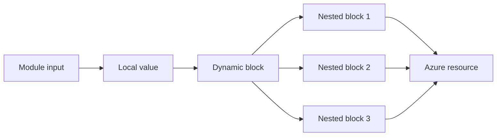
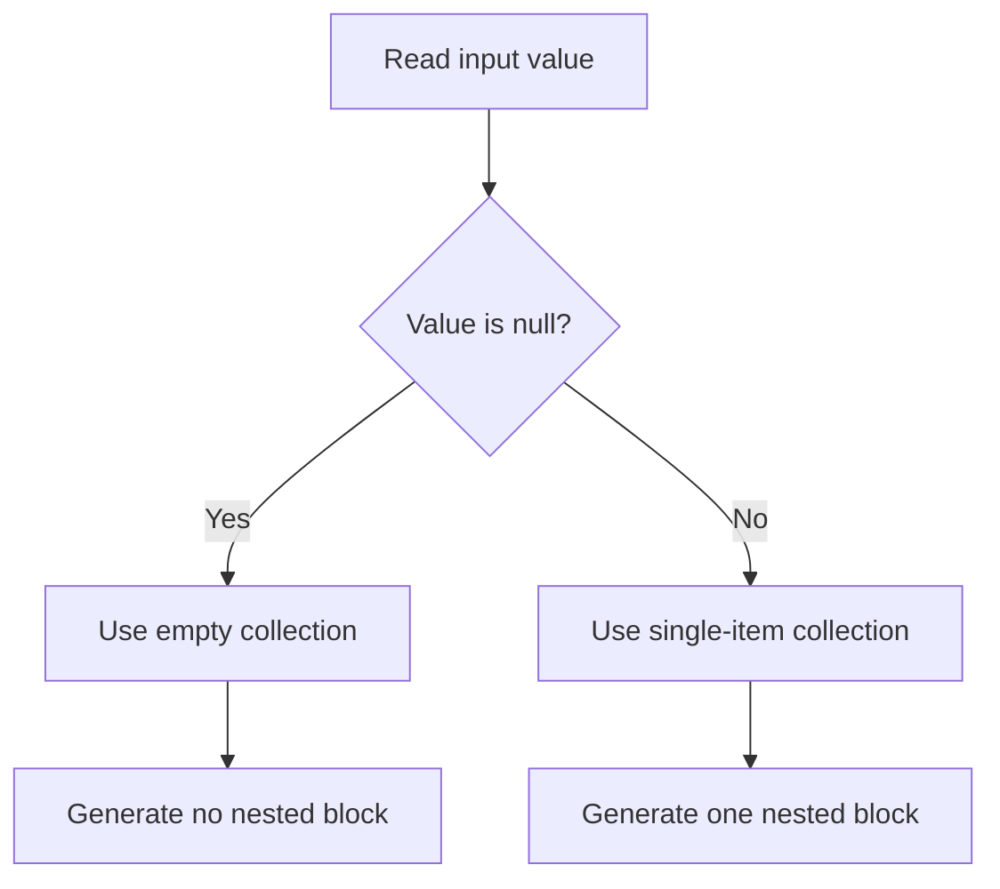
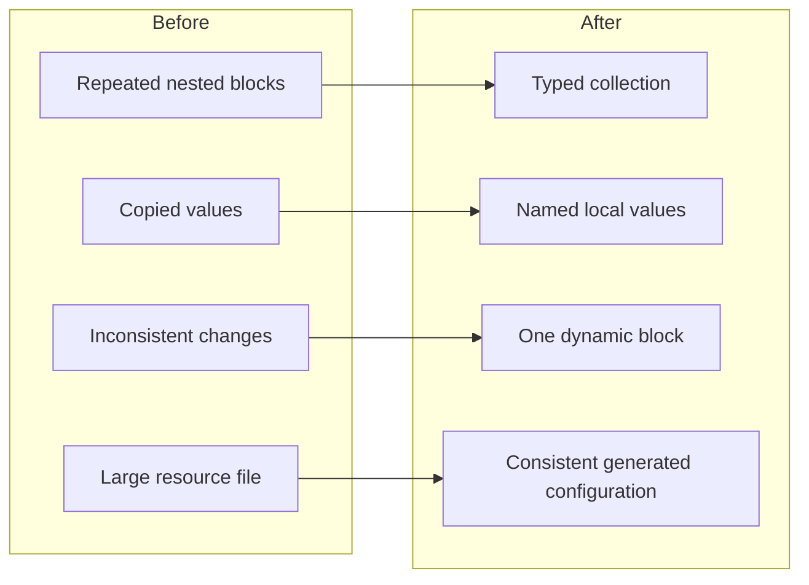

You open a Terraform module and find six nearly identical `security_rule` blocks. The only differences are the rule name, priority, port and source address.

Adding another rule means copying an existing block, changing four values and hoping you remembered the fifth. Removing one means checking that nothing else depends on its hard-coded name. It works, but it does not scale particularly well.

This is the problem dynamic blocks solve. They let you generate repeatable nested blocks from a collection, which is useful for Azure resources such as network security groups, Application Gateways, private endpoints and diagnostic settings.

They also make it remarkably easy to hide an entire architecture inside three nested loops.

In my experience working with enterprise Azure Landing Zones, dynamic blocks work best when the repeated configuration genuinely represents data. If every generated block needs different logic, the abstraction has probably gone too far.

This article explains how dynamic blocks work, where they help, how to make optional blocks manageable and when you should use separate resources instead.



## What a dynamic block actually does

Terraform resources contain arguments and nested blocks.

An argument assigns a value:

```hcl
location = "uksouth"
```

A nested block describes a child configuration:

```hcl
security_rule {
  name                       = "AllowHttps"
  priority                   = 100
  direction                  = "Inbound"
  access                     = "Allow"
  protocol                   = "Tcp"
  source_port_range          = "*"
  destination_port_range     = "443"
  source_address_prefix      = "10.20.0.0/16"
  destination_address_prefix = "*"
}
```

A dynamic block generates one or more of those nested blocks from a collection. HashiCorp describes it as a way to construct repeatable nested configuration, rather than a way to create complete resources.

The basic structure looks like this:

```hcl
dynamic "security_rule" {
  for_each = var.security_rules

  content {
    name     = security_rule.value.name
    priority = security_rule.value.priority
  }
}
```

The label after `dynamic` must match the nested block you want Terraform to generate. In this case, each item creates a `security_rule` block.

The iterator defaults to the dynamic block label. You access its current item through:

```hcl
security_rule.key
security_rule.value
```

For a map, `key` contains the map key and `value` contains its associated value. For a list, the key represents the item index, although I generally avoid using list positions as meaningful infrastructure identifiers.

Dynamic blocks can generate provider-defined nested blocks, but they cannot generate Terraform meta-argument blocks such as `lifecycle`, `depends_on` or `provisioner`. Terraform must process those before it evaluates the dynamic content.

## Generate Azure NSG rules from structured input

Network security groups provide the classic Azure example because an NSG can contain multiple `security_rule` blocks. The AzureRM provider supports those nested rules directly within `azurerm_network_security_group`.

Start with a strongly typed input rather than `list(any)`. Types catch mistakes before the Azure API gets involved.

```hcl
variable "security_rules" {
  description = "Security rules to create within the NSG."

  type = map(object({
    priority                   = number
    direction                  = string
    access                     = string
    protocol                   = string
    source_port_range          = optional(string, "*")
    destination_port_range     = string
    source_address_prefix      = string
    destination_address_prefix = optional(string, "*")
    description                = optional(string)
  }))

  validation {
    condition = alltrue([
      for rule in values(var.security_rules) :
      rule.priority >= 100 && rule.priority <= 4096
    ])

    error_message = "NSG rule priorities must be between 100 and 4096."
  }
}
```

You can then generate the nested blocks:

```hcl
resource "azurerm_network_security_group" "this" {
  name                = var.name
  location            = var.location
  resource_group_name = var.resource_group_name

  dynamic "security_rule" {
    for_each = var.security_rules

    content {
      name                       = security_rule.key
      priority                   = security_rule.value.priority
      direction                  = security_rule.value.direction
      access                     = security_rule.value.access
      protocol                   = security_rule.value.protocol
      source_port_range          = security_rule.value.source_port_range
      destination_port_range     = security_rule.value.destination_port_range
      source_address_prefix      = security_rule.value.source_address_prefix
      destination_address_prefix = security_rule.value.destination_address_prefix
      description                = security_rule.value.description
    }
  }

  tags = var.tags
}
```

A caller can now supply a concise map:

```hcl
security_rules = {
  AllowHttpsFromCorp = {
    priority               = 100
    direction              = "Inbound"
    access                 = "Allow"
    protocol               = "Tcp"
    destination_port_range = "443"
    source_address_prefix  = "10.20.0.0/16"
    description            = "Allow HTTPS from the corporate network."
  }

  DenyInternetInbound = {
    priority               = 4096
    direction              = "Inbound"
    access                 = "Deny"
    protocol               = "*"
    destination_port_range = "*"
    source_address_prefix  = "Internet"
    description            = "Explicitly deny unsolicited internet traffic."
  }
}
```

Using a map gives each rule a stable key. It also makes code review easier because the rule name sits next to its configuration rather than depending on its position in a list.

### Do not automate unsafe rules efficiently

Dynamic blocks reduce repetition. They do not make the repeated configuration secure.

Validate sensitive values where possible. For example, you may decide that a reusable workload module must never allow inbound management ports directly from the internet:

```hcl
validation {
  condition = alltrue([
    for rule in values(var.security_rules) :
    !(
      rule.direction == "Inbound" &&
      rule.access == "Allow" &&
      rule.source_address_prefix == "Internet" &&
      contains(["22", "3389"], rule.destination_port_range)
    )
  ])

  error_message = "Inbound SSH or RDP access from the Internet is not permitted."
}
```

I have seen modules accept completely unrestricted NSG rules because “the application team owns the input”. That is not a security boundary; it is an administrative shrug.

## Create optional blocks without awkward duplication

Some provider blocks are optional. You may want Terraform to create one only when the caller enables a feature.

A useful pattern is to give `for_each` either a single-item collection or an empty collection.

Consider an Azure Storage Account where blob properties are optional:

```hcl
variable "blob_properties" {
  type = object({
    versioning_enabled  = optional(bool, true)
    change_feed_enabled = optional(bool, false)

    delete_retention_days = optional(number)
  })

  default = {
    versioning_enabled  = true
    change_feed_enabled = false
  }
}
```

The dynamic block can always generate the parent configuration:

```hcl
resource "azurerm_storage_account" "this" {
  name                     = var.name
  resource_group_name      = var.resource_group_name
  location                 = var.location
  account_tier             = "Standard"
  account_replication_type = "ZRS"

  dynamic "blob_properties" {
    for_each = [var.blob_properties]

    content {
      versioning_enabled  = blob_properties.value.versioning_enabled
      change_feed_enabled = blob_properties.value.change_feed_enabled

      dynamic "delete_retention_policy" {
        for_each = (
          blob_properties.value.delete_retention_days == null
          ? []
          : [blob_properties.value.delete_retention_days]
        )

        content {
          days = delete_retention_policy.value
        }
      }
    }
  }
}
```

The inner dynamic block creates no `delete_retention_policy` block when the value is `null`. When the caller supplies a number, Terraform creates exactly one.



This pattern works, but use it carefully. A normal static block is clearer when the block always exists.

Do not reach for `dynamic` merely because you can. Terraform will not award extra points for making three lines look like twelve.

## Use named iterators for nested dynamic blocks

Azure Application Gateway contains several collections of nested blocks, including frontend ports, listeners, backend pools and routing rules. The provider documentation reflects how much configuration the resource holds.

When you nest dynamic blocks or work with several similarly named objects, set an explicit iterator. This avoids expressions such as `frontend_port.value.port`, which become harder to follow once the nesting grows.

```hcl
variable "frontend_ports" {
  type = map(number)

  default = {
    http  = 80
    https = 443
  }
}

resource "azurerm_application_gateway" "this" {
  name                = var.name
  resource_group_name = var.resource_group_name
  location            = var.location

  # Other required Application Gateway configuration omitted.

  dynamic "frontend_port" {
    for_each = var.frontend_ports
    iterator = port_config

    content {
      name = port_config.key
      port = port_config.value
    }
  }
}
```

The iterator name describes the data rather than repeating the provider block name.

A more realistic module might normalise several listener settings in a local value:

```hcl
locals {
  listeners = {
    website = {
      frontend_port_name = "https"
      host_name          = "www.example.co.uk"
      require_sni        = true
    }

    api = {
      frontend_port_name = "https"
      host_name          = "api.example.co.uk"
      require_sni        = true
    }
  }
}
```

You can then generate the listeners:

```hcl
dynamic "http_listener" {
  for_each = local.listeners
  iterator = listener

  content {
    name                           = listener.key
    frontend_ip_configuration_name = "private-frontend"
    frontend_port_name             = listener.value.frontend_port_name
    protocol                       = "Https"
    host_name                      = listener.value.host_name
    require_sni                    = listener.value.require_sni
    ssl_certificate_name           = "wildcard-certificate"
  }
}
```

This is useful when every listener follows the same design. It becomes less useful when each listener requires different certificates, redirects, firewall policies and routing behaviour.

At that point, consider a clearer input model, smaller modules or separate resources where the provider supports them.

## Decide whether a dynamic block is the right abstraction

The real design question is not “Can I make this dynamic?” It is “Will this make the module easier to operate?”

I use three tests.

### The repeated blocks must share a shape

Dynamic blocks work well when each item contains the same fields and follows the same rules. NSG rules and Application Gateway frontend ports fit that model.

If half of the items require different arguments and several special cases, the input object becomes a collection of optional attributes and conditional expressions. You have replaced repeated HCL with a small configuration language that only your team understands.

### The input should describe intent

This is reasonable:

```hcl
frontend_ports = {
  http  = 80
  https = 443
}
```

This is less helpful:

```hcl
blocks = [
  {
    block_type = "frontend_port"
    values     = {}
  }
]
```

Your module interface should describe the Azure capability, not expose Terraform’s internal mechanics to the caller.

### The plan must remain reviewable

Large dynamic collections can create lengthy plans. Some Azure resources also model nested objects as sets, which can make a small change appear as though Terraform will remove and re-add several entries in the plan even when the provider is reconciling the collection. The current Application Gateway documentation explicitly warns about this behaviour for set-backed objects.

Inspect plans carefully and test changes against non-production environments. A technically correct abstraction is not much use when nobody can confidently review its output.



## Common mistakes

**Using dynamic blocks for top-level resources.** Use `for_each` or `count` on the resource itself. Dynamic blocks only generate nested blocks inside another resource, data source, provider or provisioner.

**Making every nested block dynamic.** Keep static configuration static. A normal block is easier to read when it always exists.

**Passing untyped data into security controls.** Define object types and validation for NSG rules, firewall settings and public exposure. Do not let `any` become your security model.

**Using list indexes as identities.** Prefer maps with meaningful keys. Reordering a list can otherwise create noisy plans or unwanted replacements.

**Hiding too much logic in one expression.** Normalise complex input in `locals`, name your iterators and keep the dynamic block focused on rendering the result.

## Summary

Dynamic blocks help when an Azure resource needs several nested blocks with the same structure. They turn a typed collection into repeatable provider configuration and remove the need to copy nearly identical HCL.

Use maps with stable keys, validate security-sensitive inputs and move complicated transformations into named local values. For optional blocks, iterate over an empty or single-item collection rather than duplicating the resource.

Most importantly, keep the abstraction proportionate. A dynamic block should make the module easier to understand and change. When it starts hiding dozens of conditional attributes and exceptions, some repetition may genuinely be the cleaner option.

## What to Explore Next

* Read [Terraform Locals: Cleaner Code Without the Clutter](/terraform-locals-cleaner-code-without-the-clutter/) for normalising module input.
* Review [Azure RBAC: Getting Role Assignments Right](/azure-rbac-getting-role-assignments-right/) before generating access configuration.
* Explore [Azure Policy Explained](/azure-policy-explained/) for governance controls around dynamically created resources.
* Read the official [HashiCorp dynamic blocks documentation](https://developer.hashicorp.com/terraform/language/expressions/dynamic-blocks).

Connect with me on [LinkedIn](https://www.linkedin.com/in/jrmurray86/), explore the examples in the [RAWRitsCloud GitHub repository](https://github.com/RAWRitsCloud), and continue through the related Azure and Terraform articles on RAWRitsCloud.
