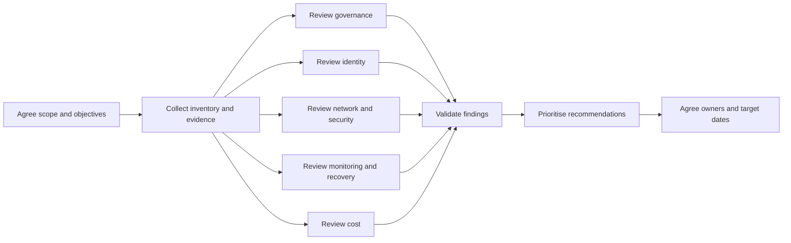
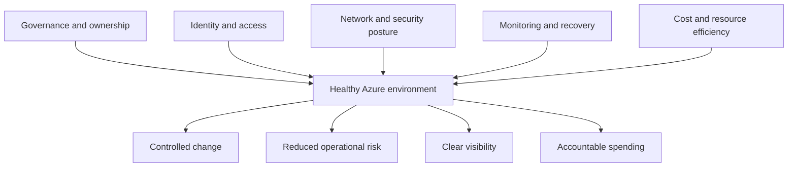

You open an Azure tenant you have never seen before. It contains dozens of subscriptions, hundreds of resource groups and several naming conventions that apparently evolved through natural selection.

Someone asks, “Is the environment healthy?”

The portal will not give you a single, honest answer to that question. Azure Advisor, Defender for Cloud and Cost Management all provide useful information, but each only shows part of the picture. A low monthly bill does not mean the environment is well governed, and a respectable Secure Score does not prove that anyone can restore the production database.

When I carry out an Azure health check, I am looking for patterns rather than isolated configuration problems. I want to understand how the environment operates, where risk has accumulated and which improvements will make a practical difference.

These are the five areas I consistently examine: governance, identity, networking and security, monitoring and recovery, and cost. I also look at how to turn the findings into recommendations that somebody can actually implement.



## Start with evidence, not portal tourism

Before examining individual resources, I establish the scope of the assessment. That means confirming which tenants, management groups, subscriptions and workloads are included, along with any regulatory or operational requirements.

Without that agreement, a health check can quickly become an enthusiastic tour of Azure Portal blades. You find plenty of interesting things but cannot confidently say whether they matter.

I normally collect evidence from several sources:

* Azure Resource Graph for inventory and configuration patterns
* Azure Policy compliance results
* Microsoft Defender for Cloud recommendations
* Azure Advisor recommendations
* Cost Management data
* Azure Monitor, Activity Log and Resource Health
* Existing architecture diagrams, operational documents and Terraform repositories
* Conversations with the engineers who run the environment

That final source matters. A technically odd configuration sometimes has a perfectly sensible operational reason. Equally, a beautifully drawn architecture diagram may describe an environment that stopped existing two migrations ago.

The five review areas fit together rather than operating as separate checklists:



## 1. Governance and management groups

I start with governance because it tells me whether the environment has a repeatable operating model or merely a collection of subscriptions.

Azure management groups provide a governance scope above subscriptions. Policies and role assignments applied higher in the hierarchy can flow down to child management groups and subscriptions through inheritance. That makes the hierarchy one of the first things worth reviewing.

I look for a structure that reflects **governance requirements**, not the organisation chart. Business departments change frequently. Security, connectivity, platform and workload requirements tend to change more slowly.

Typical questions include:

* Are production and non-production workloads separated appropriately?
* Are platform subscriptions separated from application subscriptions?
* Do sandbox subscriptions have different controls from production?
* Are policies assigned at the correct level?
* Is anything important assigned directly at the tenant root?
* Who owns each subscription?
* Is there a documented process for creating and closing subscriptions?

I also inspect naming, tagging and resource organisation. Tags do not fix weak governance, but missing ownership and environment metadata make cost allocation, incident response and lifecycle management considerably harder.

Azure Resource Graph provides a quick way to identify missing tags across every accessible subscription:

```kusto
Resources
| where isempty(tags['Environment'])
    or isempty(tags['Owner'])
    or isempty(tags['CostCentre'])
| project
    subscriptionId,
    resourceGroup,
    name,
    type,
    environment = tostring(tags['Environment']),
    owner = tostring(tags['Owner']),
    costCentre = tostring(tags['CostCentre'])
| order by subscriptionId asc, resourceGroup asc
```

This query does not tell you whether your tagging model is good. It tells you whether the model you claim to have is actually being followed, which is usually the more interesting question.

In one enterprise environment, I found policy assignments at individual subscription level that were almost identical but not quite. Each team had copied the original policy set and then made small local changes. Moving towards central policy assignments became a long-term improvement, whilst correcting several missing diagnostic settings was an immediate quick win.

For more detail on structuring governance, see [Azure Landing Zones Explained](/azure-landing-zones-explained/) and [Azure Management Groups Explained](/azure-management-groups-explained/).

## 2. Identity and RBAC

The next question is simple: **who can change what?**

The answer is rarely simple.

I review Azure RBAC assignments at management group, subscription, resource group and critical resource scopes. I pay particular attention to Owner, User Access Administrator, Contributor and custom roles with broad wildcard permissions.

Microsoft recommends removing unnecessary privileged assignments, using job-function roles where possible and assigning privileged access at the narrowest practical scope.

Specific warning signs include:

* Permanent privileged access assigned directly to individual users
* Large numbers of subscription-level Owners
* Access granted to accounts that no longer have an obvious purpose
* Service principals using Contributor when they need a much smaller permission set
* Custom roles nobody can explain
* Privileged groups without clear ownership or access reviews
* Automation accounts using stored client secrets instead of managed identities or workload identity federation

I also check whether operational access uses Microsoft Entra Privileged Identity Management. Just-in-time access with approval and audit history is preferable to permanent Owner access handed out because somebody might need it one Friday evening.

Do not stop at control-plane access. Key Vault, Storage, SQL and other services can have separate data-plane permissions. A user might be unable to reconfigure a storage account but still have access to the data inside it.

Terraform can prevent some recurring mistakes by making role assignments explicit and reviewable:

```hcl
resource "azurerm_role_assignment" "application_key_vault_secrets" {
  scope                = azurerm_key_vault.application.id
  role_definition_name = "Key Vault Secrets User"
  principal_id         = azurerm_linux_web_app.application.identity[0].principal_id
}
```

The important detail is not the Terraform syntax. It is that the application receives a specific data role on one Key Vault rather than Contributor across the resource group.

I have wasted a good afternoon tracing access that came from a management group assignment several levels above the affected resource. Always review inherited access, not just the assignments visible at the resource itself.

## 3. Networking and security posture

Networking reviews often begin with virtual networks and end with the discovery that three different teams believe they own DNS.

I start by mapping connectivity:

* Internet ingress and egress
* Hybrid connectivity
* Hub-and-spoke or Virtual WAN topology
* Network peering
* DNS resolution
* Private endpoints
* Firewalls, network virtual appliances and route tables
* Load balancers, gateways and application delivery services

Then I look for unintended exposure. Public IP addresses, permissive network security group rules, public PaaS endpoints and unrestricted management ports deserve attention, particularly when the resource is supposed to be private.

This Resource Graph query provides a useful starting point for reviewing public IP addresses:

```kusto
Resources
| where type =~ 'microsoft.network/publicipaddresses'
| extend
    assigned = isnotempty(properties.ipConfiguration.id),
    ipAddress = tostring(properties.ipAddress),
    allocationMethod = tostring(properties.publicIPAllocationMethod)
| project
    subscriptionId,
    resourceGroup,
    name,
    location,
    ipAddress,
    allocationMethod,
    assigned
| order by assigned asc, subscriptionId asc
```

An unattached public IP is usually a quick cost and housekeeping win. An attached public IP needs context: what uses it, why is it public, which controls protect it and who owns the decision?

I use Defender for Cloud recommendations as evidence, not as an automatic remediation queue. Defender assesses resources against security policies and provides recommendations with affected resources and remediation guidance. Current risk prioritisation can also consider factors such as exposure and attack paths.

Secure Score is useful for spotting broad trends, but chasing the score without considering workload risk can lead to odd priorities. Fixing an exposed production database matters more than improving ten low-impact development findings simply because the dashboard moves further.

I also check whether teams have documented exceptions. A justified exception with an owner and review date is governance. A recommendation dismissed by somebody who has since left is archaeology.

## 4. Monitoring, backup and recovery

A resource showing as **Running** does not mean anyone knows when it is failing.

I review whether critical workloads have useful metrics, logs and alerts. “Useful” is doing quite a lot of work in that sentence. An alert that emails an abandoned shared mailbox at 03:00 is technically configured but operationally decorative.

Azure collects platform metrics and Activity Log data automatically, but most resource logs require diagnostic settings before Azure sends them to destinations such as Log Analytics.

I check:

* Diagnostic settings on critical resources
* Central Log Analytics workspace design and retention
* Action groups and notification ownership
* Availability, latency, capacity and error alerts
* Activity Log alerts for high-risk control-plane changes
* Resource Health and Service Health alerts
* Workbook or dashboard ownership
* Alert noise, suppression and escalation
* Backup policies, retention and protected resource coverage
* Restore testing and recovery documentation

A small Terraform improvement can prevent critical resources from being deployed without basic diagnostics and deletion protection:

```hcl
resource "azurerm_monitor_diagnostic_setting" "key_vault" {
  name                       = "send-to-central-logs"
  target_resource_id         = azurerm_key_vault.application.id
  log_analytics_workspace_id = var.log_analytics_workspace_id

  enabled_log {
    category_group = "audit"
  }

  enabled_metric {
    category = "AllMetrics"
  }
}

resource "azurerm_management_lock" "key_vault" {
  name       = "protect-critical-key-vault"
  scope      = azurerm_key_vault.application.id
  lock_level = "CanNotDelete"
  notes      = "Removal requires an approved change."
}
```

You should still validate which diagnostic categories the resource supports. Applying one generic block to every resource type normally ends in provider errors, missing logs or both.

Backup coverage alone is not enough. I ask when the organisation last restored the workload, how long the restore took and whether it met the recovery objective. A green backup job proves Azure created a recovery point; it does not prove your service can recover within the time the business expects.

For related monitoring detail, see [Activity Log and Resource Health](/activity-log-and-resource-health/).

## 5. Cost optimisation and actionable recommendations

Cost is important, but I deliberately review it last.

Starting with cost can distort the assessment. You may recommend removing redundancy, shortening retention or downsizing resources before understanding why they exist. Saving £500 per month is less impressive when it introduces a four-hour production recovery gap.

Azure Advisor analyses configuration and usage telemetry across cost, reliability, security, performance and operational excellence. Its recommendations provide a useful starting point, but they still need workload context and validation.

You can retrieve cost recommendations using Azure CLI:

```bash
az advisor recommendation list \
  --category Cost \
  --refresh \
  --query "[].{
    Impact: impact,
    Resource: resourceMetadata.resourceId,
    Problem: shortDescription.problem,
    Solution: shortDescription.solution
  }" \
  --output table
```

I combine Advisor results with Cost Analysis, reservation and savings plan utilisation, budgets, anomaly alerts, tagging and actual performance data. Cost Management supports proactive monitoring through budgets, anomaly alerts and reservation utilisation alerts.

Common opportunities include:

* Unattached disks, public IP addresses and network interfaces
* Empty App Service plans
* Underused virtual machines and databases
* Oversized Log Analytics retention
* Old snapshots and recovery points without a retention reason
* Non-production resources running outside working hours
* Poor reservation or savings plan utilisation
* Premium SKUs selected without a requirement for premium features

I separate findings into **quick wins** and **longer-term improvements**.

A quick win has low implementation risk, clear ownership and measurable value. Deleting an unattached disk after confirming it is not required fits that description.

A longer-term improvement changes the operating model. Examples include redesigning the management group hierarchy, introducing identity governance, standardising diagnostics through Azure Policy or rebuilding the network topology.

Every recommendation I produce includes:

| Field           | Purpose                                   |
| --------------- | ----------------------------------------- |
| Finding         | What I observed and where                 |
| Risk or impact  | Why it matters                            |
| Recommendation  | The specific change required              |
| Priority        | Critical, high, medium or low             |
| Effort          | Small, medium or large                    |
| Owner           | The team accountable for delivery         |
| Evidence        | Query output, configuration or screenshot |
| Success measure | How you will know the issue is resolved   |

“Review RBAC” is not a recommendation. “Remove permanent Owner access for named user accounts, replace it with PIM-eligible access through the Platform Administrators group and complete quarterly access reviews” is something a team can plan and deliver.

## Common mistakes

**Focusing only on cost.** Cost reviews find waste, but they do not tell you whether the environment is secure, recoverable or governable. Review cost alongside operational and architectural risk.

**Ignoring inherited governance and access.** A subscription may look clean until you inspect management group policy and RBAC inheritance. Always review the full scope hierarchy.

**Treating tool recommendations as unquestionable facts.** Advisor and Defender for Cloud identify patterns. Validate each finding against workload requirements before changing production.

**Producing a report without owners or priorities.** A long document containing 80 observations is not an improvement plan. Assign an owner, priority, effort and measurable outcome to each recommendation.

**Missing quick wins.** Strategic improvements matter, but teams lose confidence when every recommendation needs a six-month programme. Include safe changes that can show progress within days.

## Summary

A useful Azure health check does more than count warnings in Azure Advisor.

Start with governance to understand how the environment controls subscriptions, policy and ownership. Review identity across inherited RBAC and data-plane access, then map network connectivity and investigate unintended exposure.

Check whether monitoring reaches the right people and whether backups have been restored successfully, not merely configured. Finally, examine cost with enough architectural context to avoid recommending savings that create larger operational risks.

The quality of the final report matters as much as the technical findings. Prioritised recommendations with evidence, owners and success measures give teams something they can deliver. A beautifully formatted list of problems mainly gives everyone another document to ignore.

## What to Explore Next

* Read [Azure Landing Zones Explained](/azure-landing-zones-explained/) to understand the wider platform design.
* Review [Azure Management Groups Explained](/azure-management-groups-explained/) before redesigning your hierarchy.
* Explore [Cost Management Tips That Actually Save Money](/cost-management-tips-that-actually-save-money/).
* Continue the Azure Learning Path and find supporting examples in the [RAWRitsCloud GitHub repository](https://github.com/RAWRitsCloud).

For more Azure architecture, Terraform and automation content, connect with me on [LinkedIn](https://www.linkedin.com/in/jrmurray86/) and follow the wider RAWRitsCloud learning path.
