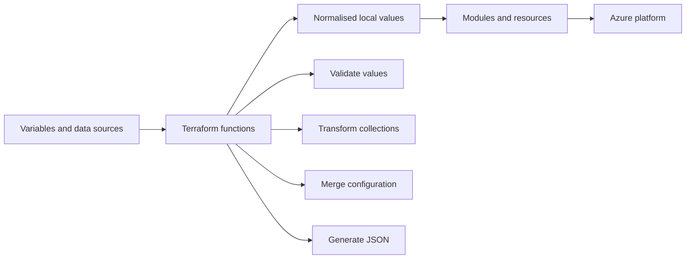
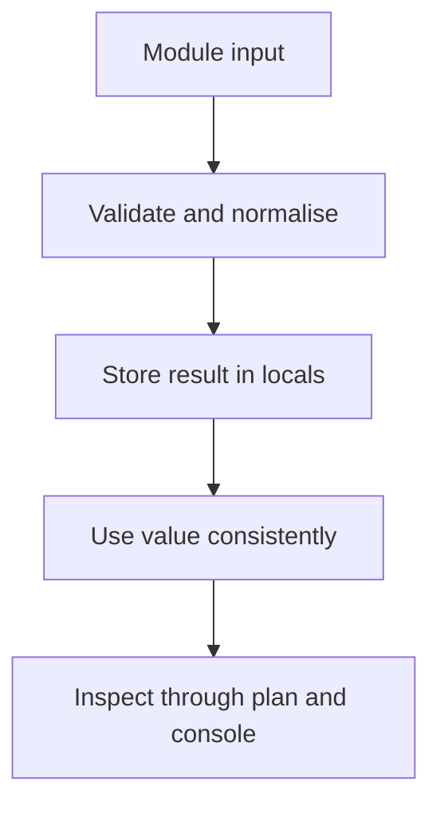
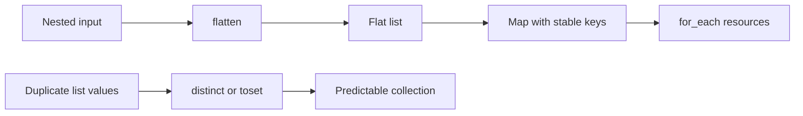
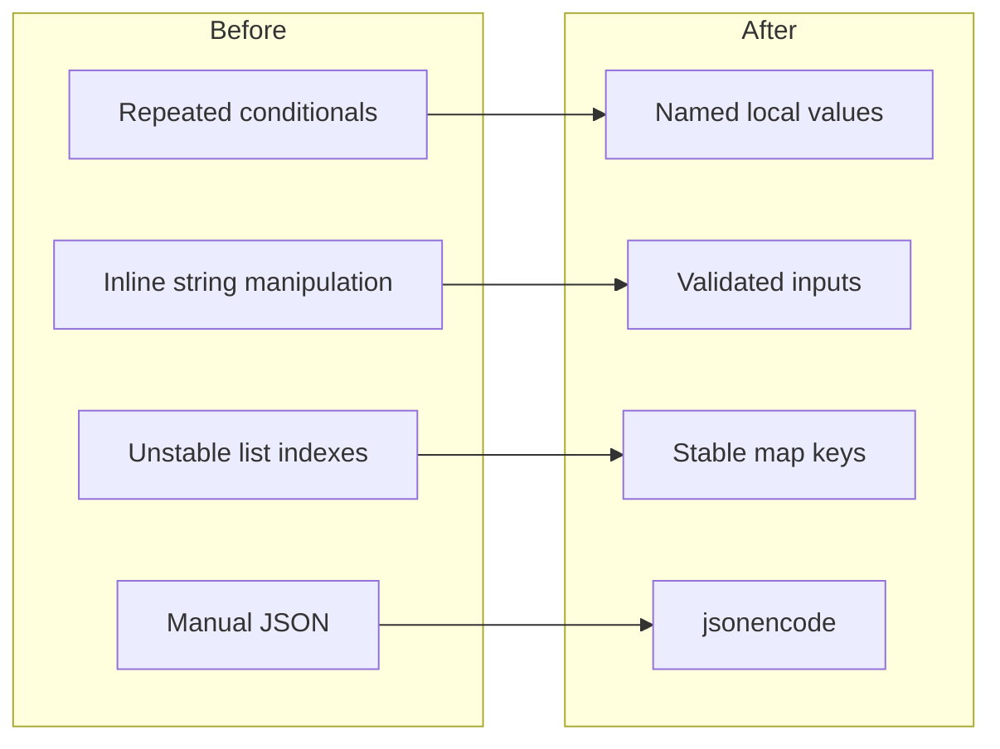

You inherit a Terraform repository for an Azure platform and find the same problem repeated everywhere. Resource names are assembled slightly differently, optional settings rely on nested conditional expressions, and three modules each contain their own version of the same tag-merging logic.

The configuration works, technically. Unfortunately, understanding it requires equal parts patience, optimism and archaeology.

Terraform functions will not fix a poor module design, but they can remove a surprising amount of unnecessary complexity. Used well, they help you normalise inputs, reshape collections, handle optional values and generate structured configuration without copying the same logic across every resource.

Used badly, they create unreadable expressions that nobody wants to touch during an incident.

In my experience working with enterprise Azure Landing Zones, a relatively small group of functions covers most practical requirements. This article looks at the functions I use regularly, where they help, where they create problems and how to keep the resulting Terraform understandable.



## Functions should simplify the configuration

Terraform functions transform values inside expressions. You might use one to combine maps, remove duplicate values, decode JSON or safely inspect an optional attribute.

The important point is that functions should make your configuration easier to reason about. They should not hide half of your platform design inside a single heroic expression.

I normally use functions inside `locals` rather than directly inside large resource blocks. This gives the transformation a meaningful name and lets you inspect it with `terraform console`.

```hcl
locals {
  default_tags = {
    ManagedBy   = "Terraform"
    Environment = var.environment
    Workload    = var.workload_name
  }

  resource_tags = merge(local.default_tags, var.additional_tags)
}
```

You can then reference `local.resource_tags` consistently:

```hcl
resource "azurerm_resource_group" "this" {
  name     = "rg-${var.workload_name}-${var.environment}-${var.location_short}"
  location = var.location
  tags     = local.resource_tags
}
```

This approach creates a clear flow from input to transformed value to Azure resource.



## Handle optional values with `try`, `can` and `coalesce`

Optional configuration causes a disproportionate amount of awkward Terraform. A module may allow a caller to specify a value, inherit a platform default or omit the feature completely.

Three functions help with this: `try`, `can` and `coalesce`.

### Use `try` for values that may not exist

The `try` function evaluates expressions in order and returns the first one that does not produce an error.

Suppose an application definition can optionally include a custom resource group name:

```hcl
variable "application" {
  type = object({
    name                = string
    environment         = string
    resource_group_name = optional(string)
  })
}
```

You can safely read the optional value and fall back to your naming convention:

```hcl
locals {
  resource_group_name = coalesce(
    try(var.application.resource_group_name, null),
    "rg-${var.application.name}-${var.application.environment}-uks"
  )
}
```

`try` handles the possibility that the attribute is unavailable, whilst `coalesce` selects the first non-null, non-empty value.

Keep `try` close to the input-normalisation layer. If you scatter it throughout your resources, genuine mistakes can start looking like optional configuration.

### Use `can` for validation

The `can` function returns `true` when Terraform can evaluate an expression without an error. It works particularly well inside variable validation.

This example checks that an environment code matches an agreed set:

```hcl
variable "environment" {
  type = string

  validation {
    condition = can(
      regex("^(dev|test|stg|prod)$", var.environment)
    )

    error_message = "Environment must be dev, test, stg or prod."
  }
}
```

The result is better than allowing an unexpected value to reach your naming, tagging and policy configuration.

In enterprise platforms, input validation is not cosmetic. A single inconsistent environment value can affect policy exemptions, cost reporting, automation and deployment pipelines.

## Reshape collections with `flatten`, `toset` and `distinct`

Terraform modules often receive nested collections because real environments rarely fit into one flat list. Applications have subnets, subscriptions have role assignments, and management groups contain policy assignments.

The provider resource usually wants one item at a time. That means you need to reshape the input before using `for_each`.

Consider a map of virtual networks, each containing several subnets:

```hcl
variable "virtual_networks" {
  type = map(object({
    resource_group_name = string
    address_space       = list(string)

    subnets = map(object({
      address_prefixes = list(string)
    }))
  }))
}
```

You can flatten the nested subnet structure into a single list:

```hcl
locals {
  subnets = flatten([
    for vnet_name, vnet in var.virtual_networks : [
      for subnet_name, subnet in vnet.subnets : {
        key                 = "${vnet_name}.${subnet_name}"
        virtual_network_name = vnet_name
        resource_group_name  = vnet.resource_group_name
        subnet_name          = subnet_name
        address_prefixes     = subnet.address_prefixes
      }
    ]
  ])

  subnets_by_key = {
    for subnet in local.subnets : subnet.key => subnet
  }
}
```

The resource can then use a stable key:

```hcl
resource "azurerm_subnet" "this" {
  for_each = local.subnets_by_key

  name                 = each.value.subnet_name
  resource_group_name  = each.value.resource_group_name
  virtual_network_name = each.value.virtual_network_name
  address_prefixes     = each.value.address_prefixes
}
```

The stable key matters. Using list indexes for infrastructure resources can cause unnecessary replacement when somebody inserts a new item in the middle of the list.

### Remove duplicate values deliberately

Use `distinct` when you need to preserve list ordering but remove duplicates:

```hcl
locals {
  dns_servers = distinct(
    concat(var.platform_dns_servers, var.workload_dns_servers)
  )
}
```

Use `toset` when ordering does not matter and you need unique values, particularly for `for_each`:

```hcl
resource "azurerm_resource_provider_registration" "this" {
  for_each = toset(var.resource_providers)

  name = each.value
}
```

Do not convert a list to a set merely to make an error disappear. Sets discard ordering and duplicates, which may change the meaning of your input.



## Combine configuration with `merge`, `lookup` and `zipmap`

Most Azure platforms combine global defaults, environment settings and workload-specific overrides.

The `merge` function is ideal for this, but you need to understand precedence. When maps contain the same key, the value from the map furthest to the right wins.

```hcl
locals {
  platform_tags = {
    ManagedBy = "Terraform"
    Owner     = "Cloud Platform"
  }

  environment_tags = {
    Environment = var.environment
    Criticality = var.environment == "prod" ? "High" : "Standard"
  }

  tags = merge(
    local.platform_tags,
    local.environment_tags,
    var.workload_tags
  )
}
```

This allows the workload to override platform values, including `Owner`. That may be intentional, or it may undermine your tagging standard.

Where certain tags must remain controlled, apply them last:

```hcl
locals {
  tags = merge(
    var.workload_tags,
    {
      ManagedBy   = "Terraform"
      Environment = var.environment
    }
  )
}
```

I have seen teams assume that the first map wins and then spend an afternoon wondering why production resources have development metadata. Terraform was doing exactly what it was told, as usual.

### Use `lookup` when a key may be absent

`lookup` retrieves a map value and lets you provide a default:

```hcl
locals {
  log_retention_days = lookup(
    var.log_retention_by_environment,
    var.environment,
    30
  )
}
```

This works well for environment-specific defaults, although an object with optional attributes may provide stronger type checking for complex module inputs.

### Use `zipmap` to pair related lists

`zipmap` creates a map by combining one list of keys with one list of values.

```hcl
locals {
  subnet_ids_by_name = zipmap(
    azurerm_subnet.this[*].name,
    azurerm_subnet.this[*].id
  )
}
```

This can be useful when consuming outputs from older modules that expose parallel lists. For new modules, I prefer returning a properly structured map directly. Parallel lists rely on matching order, which is not the sort of excitement your infrastructure code needs.

## Generate structured configuration with `jsonencode`

Azure resources frequently require JSON configuration. Examples include Azure Policy definitions, role definitions, diagnostic settings and application configuration.

You can write JSON using a heredoc, but interpolation and escaping become painful quickly. `jsonencode` lets you build the value using normal Terraform types.

This example creates a simple custom role definition:

```hcl
resource "azurerm_role_definition" "resource_health_reader" {
  name  = "Resource Health Reader"
  scope = data.azurerm_subscription.current.id

  permissions {
    actions = [
      "Microsoft.ResourceHealth/*/read",
      "Microsoft.Resources/subscriptions/resourceGroups/read",
      "Microsoft.Resources/subscriptions/resources/read"
    ]

    not_actions = []
  }

  assignable_scopes = [
    data.azurerm_subscription.current.id
  ]
}
```

For resources that expect a JSON string, construct an object first:

```hcl
locals {
  policy_parameters = jsonencode({
    effect = {
      value = var.policy_effect
    }

    allowedLocations = {
      value = var.allowed_locations
    }
  })
}
```

You can then pass `local.policy_parameters` to a policy assignment.

This is safer than manually building JSON:

```hcl
parameters = <<PARAMETERS
{
  "effect": {
    "value": "${var.policy_effect}"
  }
}
PARAMETERS
```

The heredoc looks harmless until the structure becomes more complicated or a value contains characters that require escaping.

You can also use `jsondecode` or `yamldecode` to load configuration files:

```hcl
locals {
  landing_zone_config = yamldecode(
    file("${path.module}/config/landing-zones.yaml")
  )
}
```

Treat external configuration as an interface. Validate its structure rather than assuming every repository contributor will maintain perfect YAML indefinitely.

## Keep function usage operationally sensible

Terraform evaluates functions locally during configuration processing. Most functions add negligible overhead, but large nested expressions can increase plan complexity and make troubleshooting harder.

The bigger concern is operational clarity.



Use `terraform console` to test transformations before placing them in a module:

```bash
terraform console
```

You can then inspect expressions such as:

```hcl
> merge({ owner = "platform" }, { owner = "application" })
{
  "owner" = "application"
}
```

For complicated transformations, add tests using Terraform test files or validate the resulting plan in your pipeline. A function expression may be syntactically valid whilst producing the wrong resource keys, permissions or network configuration.

Security also matters. Functions such as `file`, `templatefile` and `jsondecode` can load sensitive content into Terraform values and potentially into state. Do not read secrets from local files simply because Terraform makes it convenient. Use managed identities, workload identity federation and an appropriate secret-management process instead.

## Common mistakes

**Using `try` to hide every error.** Use it to normalise optional inputs, not to suppress incorrect references or broken module outputs.

**Writing everything inline.** Move complex transformations into named locals. Your future self should not need to decode six nested functions during a failed production deployment.

**Using unstable collection keys.** Do not base `for_each` keys on list positions. Create meaningful keys from stable attributes such as the virtual network and subnet names.

**Forgetting `merge` precedence.** The rightmost map wins. Put mandatory platform values last when callers must not override them.

**Loading secrets with `file`.** Terraform may store the value in state. Use Azure Key Vault and identity-based access rather than treating the repository workspace as a secret store.

## Summary

You do not need to memorise every Terraform function. You need a small set that solves recurring infrastructure problems without hiding how your configuration works.

Use `try`, `can` and `coalesce` to validate and normalise optional input. Use `flatten`, `toset` and `distinct` to turn nested collections into predictable values with stable resource keys.

Use `merge` carefully when combining platform defaults with workload overrides, and prefer `jsonencode` over hand-written JSON strings. Most importantly, give transformed values meaningful local names and test them before they reach your Azure resources.

Functions should reduce repetition and make intent clearer. When an expression becomes harder to understand than the problem it solves, it has stopped helping.

## What to Explore Next

* Read [Terraform Locals: Cleaner Code Without the Clutter](/terraform-locals-cleaner-code-without-the-clutter/).
* Review [Azure Policy Explained](/azure-policy-explained/) before generating policy assignments with Terraform.
* Explore [Azure RBAC: Getting Role Assignments Right](/azure-rbac-getting-role-assignments-right/).
* Visit the [Terraform function documentation](https://developer.hashicorp.com/terraform/language/functions) for the full reference.

You can connect with me on [LinkedIn](https://www.linkedin.com/in/jrmurray86/), explore the examples in the [RAWRitsCloud GitHub repository](https://github.com/RAWRitsCloud), and continue through the related Terraform and Azure articles on RAWRitsCloud.
