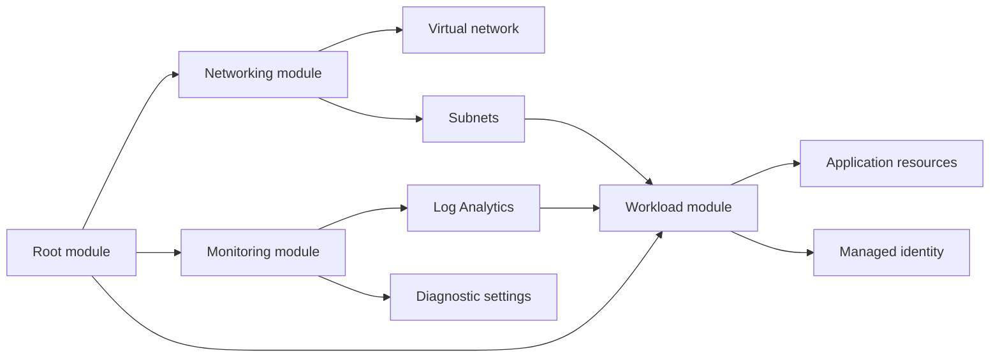
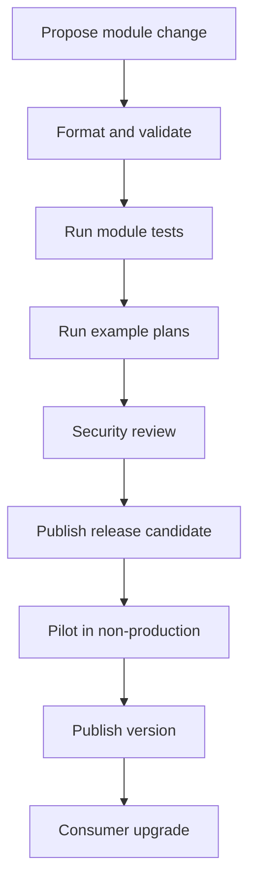
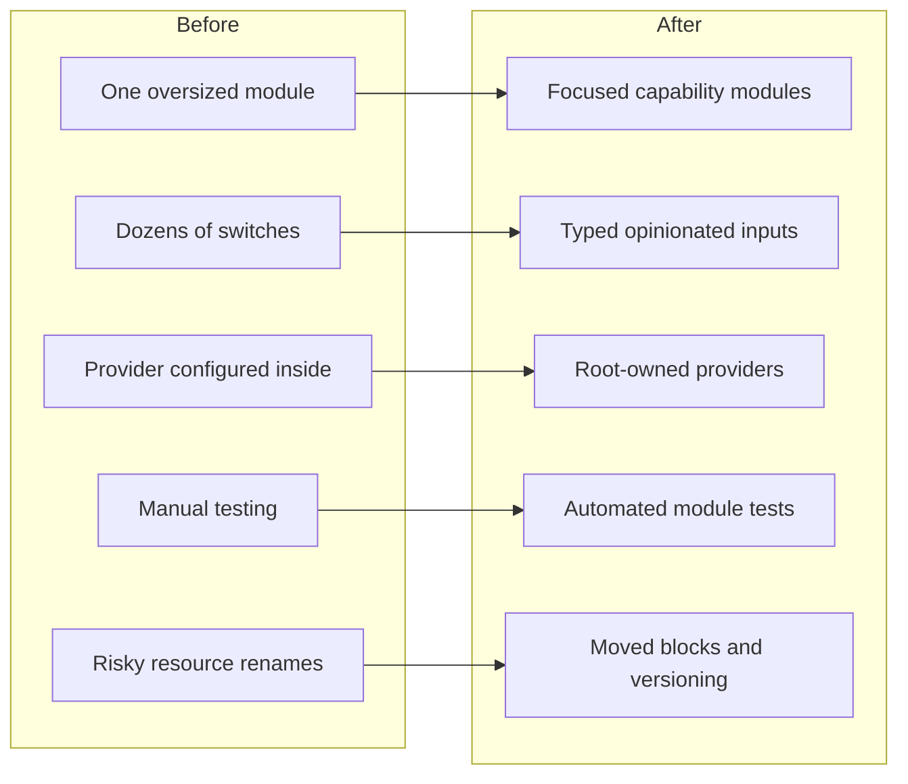

You build a Terraform module for one Azure workload. It starts with a resource group, a virtual network and a few subnets. Six months later, it also manages role assignments, diagnostic settings, private endpoints, DNS records and a collection of feature flags nobody remembers requesting.

The module still works, but changing it has become mildly terrifying.

I have seen this happen repeatedly in enterprise Azure Landing Zones. Teams begin with the sensible goal of reducing duplication, then gradually create a module that tries to support every possible workload through dozens of variables and several layers of conditional logic.

A good Terraform module should make the caller’s configuration easier to understand. It should describe an architectural capability, apply sensible defaults and prevent predictable mistakes without hiding every Azure decision from the engineer using it.

This article covers how I decide module boundaries, design inputs and outputs, manage providers, handle security, test changes and evolve modules without unexpectedly replacing production resources.



## Design modules around capabilities, not individual resources

The easiest module to write is often one that wraps a single Azure resource. Unfortunately, that does not always make it useful.

A module containing only an `azurerm_virtual_network` resource may save a few lines, but it can also expose nearly every provider argument as an input. The caller still needs to understand the full resource schema, except now they must also understand your wrapper.

I prefer modules that represent a clear platform capability:

* A spoke network with subnets, route associations and diagnostics
* A storage account configured for private access and central monitoring
* An application identity with scoped Azure RBAC assignments
* A workload resource group with standard tags, locks and budgets

HashiCorp recommends using modules as architectural abstractions and keeping the module tree relatively flat. Deeply nested module chains make individual modules harder to reuse and make dependency tracing considerably less enjoyable.

### Keep ownership boundaries clear

A module should manage resources that share a lifecycle and an owner.

Your network platform team may own the virtual network, route tables and central firewall configuration. An application team may own its private endpoint and application-specific DNS records. Putting all of those resources in one module creates an ownership problem disguised as code reuse.

In one Landing Zone implementation, I inherited a network module that created the hub, every spoke, DNS zones and workload private endpoints. A small application onboarding change required planning the entire network platform.

Nothing went wrong, but the plan was long enough to qualify as weekend reading.

A better design separates stable platform resources from frequently changing workload resources. Pass identifiers between modules rather than burying one module inside another:

```hcl
module "spoke_network" {
  source  = "app.terraform.io/rawritscloud/spoke-network/azurerm"
  version = "2.3.0"

  name                = "vnet-orders-prod-uks"
  resource_group_name = azurerm_resource_group.network.name
  address_space       = ["10.40.0.0/16"]

  subnets = {
    application = {
      address_prefixes = ["10.40.1.0/24"]
    }

    private_endpoints = {
      address_prefixes = ["10.40.2.0/24"]
    }
  }
}

module "application" {
  source  = "app.terraform.io/rawritscloud/application/azurerm"
  version = "1.7.0"

  name                         = "orders"
  application_subnet_id        = module.spoke_network.subnet_ids["application"]
  private_endpoint_subnet_id   = module.spoke_network.subnet_ids["private_endpoints"]
  log_analytics_workspace_id   = var.log_analytics_workspace_id
}
```

The root module now owns the composition. Each child module remains focused on one capability and communicates through a small set of outputs.

## Make the module interface deliberately boring

Most module problems begin at the interface.

If you expose every possible Azure property, the module becomes difficult to use. If you expose too little, callers fork the module or add manual resources around it. The useful middle ground is opinionated without being obstructive.

Every variable should have a clear type and description. Use defaults for genuinely optional behaviour, and validate values when an invalid choice would create security, naming or operational problems. HashiCorp’s current guidance recommends typed, documented variables and supports validation blocks for enforcing module requirements before Terraform creates a plan.

```hcl
variable "storage_account" {
  description = "Configuration for the workload storage account."

  type = object({
    name                     = string
    resource_group_name      = string
    location                 = string
    replication_type         = optional(string, "ZRS")
    public_network_access    = optional(bool, false)
    enable_versioning        = optional(bool, true)
  })

  validation {
    condition = contains(
      ["LRS", "ZRS", "GRS", "GZRS"],
      var.storage_account.replication_type
    )

    error_message = "Replication type must be LRS, ZRS, GRS or GZRS."
  }

  validation {
    condition = (
      var.storage_account.public_network_access == false
    )

    error_message = "This module does not permit public network access."
  }
}
```

This interface tells the caller what the module supports and prevents a configuration the platform team has explicitly rejected.

### Avoid a forest of Boolean variables

Boolean flags look convenient:

```hcl
enable_private_endpoint = true
enable_diagnostics      = true
enable_versioning       = true
enable_backup           = false
```

Once you have fifteen of them, their interactions become difficult to predict. You also end up with names such as `enable_private_endpoint_dns_registration`, at which point the module is clearly asking for help.

Group related settings into optional objects:

```hcl
variable "private_endpoint" {
  description = "Private endpoint configuration. Set to null to disable it."

  type = object({
    subnet_id           = string
    private_dns_zone_id = string
  })

  default = null
}
```

The caller either supplies a complete private endpoint configuration or leaves it disabled. That is clearer than several Boolean switches controlling fragments of the same feature.

### Return useful outputs, not the entire resource

Outputs form part of your module’s public interface. Expose the values callers genuinely need, such as resource IDs, names and principal IDs.

```hcl
output "storage_account_id" {
  description = "Resource ID of the storage account."
  value       = azurerm_storage_account.this.id
}

output "principal_id" {
  description = "Principal ID of the storage account managed identity."
  value       = azurerm_storage_account.this.identity[0].principal_id
}

output "private_endpoint_ip_address" {
  description = "Private IP address assigned to the private endpoint."
  value       = try(
    azurerm_private_endpoint.this[0].private_service_connection[0].private_ip_address,
    null
  )
}
```

Do not output an entire provider resource merely to avoid deciding what the interface should contain. That couples callers to the provider schema and makes future module changes harder.

## Keep provider configuration in the root module

A reusable child module should declare which providers it needs, but it should not configure authentication, subscription IDs or provider features.

Provider configurations belong in the root module. Child modules inherit the default provider configuration or receive an aliased provider explicitly from the caller. HashiCorp specifically advises shared child modules not to contain their own `provider` blocks, as doing so also limits how callers can use module-level `for_each`, `count` and `depends_on`.

Your child module should contain a provider requirement:

```hcl
terraform {
  required_version = ">= 1.6.0"

  required_providers {
    azurerm = {
      source  = "hashicorp/azurerm"
      version = ">= 4.0.0"
    }
  }
}
```

The root module owns the provider configuration:

```hcl
provider "azurerm" {
  subscription_id = var.workload_subscription_id

  features {}
}

provider "azurerm" {
  alias           = "connectivity"
  subscription_id = var.connectivity_subscription_id

  features {}
}
```

You can pass the correct provider into a module that needs to work in another subscription:

```hcl
module "private_dns_link" {
  source = "./modules/private-dns-link"

  providers = {
    azurerm = azurerm.connectivity
  }

  virtual_network_id  = module.spoke_network.virtual_network_id
  private_dns_zone_id = var.private_dns_zone_id
}
```

This keeps identity and subscription selection visible at the composition layer. It also prevents a child module from quietly deciding where resources should exist.

For shared modules, declare the **minimum provider version the module requires** rather than pinning an exact provider version. The root configuration should select and test the final provider version, with the dependency lock file recording the chosen provider release.

## Build security and operations into the defaults

A module creates consistency, which means it can consistently create secure resources or consistently create problems. Both are efficient.

For Azure modules, I normally make private connectivity, managed identities, diagnostic settings and secure transport part of the default design. Callers should need a deliberate exception to weaken those controls.

```hcl
resource "azurerm_storage_account" "this" {
  name                     = var.storage_account.name
  resource_group_name      = var.storage_account.resource_group_name
  location                 = var.storage_account.location
  account_tier             = "Standard"
  account_replication_type = var.storage_account.replication_type

  public_network_access_enabled   = false
  allow_nested_items_to_be_public = false
  shared_access_key_enabled       = false
  min_tls_version                 = "TLS1_2"

  identity {
    type = "SystemAssigned"
  }

  blob_properties {
    versioning_enabled = var.storage_account.enable_versioning

    delete_retention_policy {
      days = 14
    }
  }

  tags = local.tags
}
```

The module does not ask callers whether they would like basic protections. It applies them.

### Do not treat `sensitive` as encryption

Mark sensitive variables and outputs appropriately so Terraform redacts them from normal CLI output. However, Terraform can still store sensitive values in state, and commands using raw or JSON output can reveal them.

Avoid accepting passwords and secrets unless the module genuinely needs them. Prefer managed identities, workload identity federation and references to Azure Key Vault.

```hcl
variable "client_secret" {
  description = "Legacy client secret used only where identity-based access is unavailable."
  type        = string
  sensitive   = true
  default     = null
}
```

A `sensitive` label reduces accidental display. It does not make committing a secret to `terraform.tfvars` a reasonable idea.

### Consider the operational cost of flexibility

Every optional resource increases the number of code paths you must test. Every dynamic block increases the amount of configuration Terraform must evaluate and reviewers must understand.

This rarely creates a meaningful Terraform performance problem by itself. The more immediate issue is plan readability and Azure API behaviour.

A module that can deploy one of four networking models, three identity patterns and six monitoring combinations may produce dozens of possible behaviours. At that point, two focused modules often work better than one configurable masterpiece.



## Test the contract and preserve upgrade paths

A successful `terraform validate` proves that Terraform understands the syntax and configuration structure. It does not prove that your module creates the intended Azure architecture.

Terraform’s native test framework lets module authors define test files, execute plans or applies and assert expected values. HashiCorp positions `terraform test` specifically as a way to validate shared modules.

A basic test can verify your secure defaults without deploying anything:

```hcl
mock_provider "azurerm" {}

run "storage_defaults_are_secure" {
  command = plan

  variables {
    storage_account = {
      name                = "strawritscloudtest01"
      resource_group_name = "rg-test-uks"
      location            = "uksouth"
    }
  }

  assert {
    condition = (
      azurerm_storage_account.this.public_network_access_enabled == false
    )

    error_message = "Storage accounts must disable public network access."
  }

  assert {
    condition = (
      azurerm_storage_account.this.shared_access_key_enabled == false
    )

    error_message = "Storage accounts must use identity-based access."
  }
}
```

Keep runnable examples under an `examples/` directory and test those examples in your pipeline. HashiCorp’s standard module structure also recommends `main.tf`, `variables.tf`, `outputs.tf`, a README and examples for modules intended for reuse.

```text
terraform-azurerm-storage/
├── examples/
│   ├── basic/
│   └── private-endpoint/
├── tests/
│   └── storage.tftest.hcl
├── main.tf
├── variables.tf
├── outputs.tf
├── versions.tf
└── README.md
```

### Refactor without replacing resources

Renaming a Terraform resource changes its state address. Without additional instructions, Terraform may plan to destroy the old object and create a replacement.

Use a `moved` block to preserve the resource during refactoring:

```hcl
moved {
  from = azurerm_storage_account.storage
  to   = azurerm_storage_account.this
}
```

Terraform checks the old state address and moves it to the new address without recreating the Azure resource. HashiCorp recommends keeping historical `moved` blocks because removing them can break upgrade paths for consumers coming from older module releases.

Version your modules and treat breaking interface changes deliberately. A renamed variable, changed output type or newly required input can affect dozens of callers even when the underlying Azure resources remain unchanged.



Before writing a custom module, also check whether an appropriate Azure Verified Module already exists. Microsoft develops and maintains Azure Verified Modules for common Azure resource and architectural patterns, with defined design and security requirements.

You may still need your own wrapper or composition layer, but starting from an established module is often better than maintaining another private interpretation of the same Azure service.

## Common Mistakes

**Wrapping every Azure resource.** A module should represent a useful capability. Do not create a thin wrapper that exposes the provider schema under slightly different variable names.

**Creating one module for an entire platform.** Split resources by ownership and lifecycle. Keep the root module responsible for composing networking, monitoring, identity and workload modules.

**Adding a variable for every argument.** Expose decisions that genuinely vary. Keep mandatory platform standards as internal defaults.

**Configuring providers inside child modules.** Declare provider requirements in the child module, but keep credentials, subscriptions and aliases in the root.

**Breaking state addresses during refactoring.** Use `moved` blocks and versioned releases rather than expecting every consumer to run manual state commands correctly.

## Summary

A good Terraform module gives you a clear architectural capability rather than a configurable wrapper around one Azure resource.

Keep module boundaries aligned with ownership and lifecycle, and compose modules from the root rather than building a deeply nested dependency tree. Design a small, typed interface with secure defaults, useful validation and only the outputs callers genuinely need.

Keep provider configuration in the root module so subscription and identity choices remain visible. Test the module contract, maintain runnable examples and use `moved` blocks when refactoring existing state addresses.

The goal is not maximum flexibility. The goal is predictable infrastructure that another engineer can understand, deploy and safely change without consulting the module’s original author or a medium.

## What to Explore Next

* Read [Terraform Locals: Cleaner Code Without the Clutter](/terraform-locals-cleaner-code-without-the-clutter/) for simplifying module internals.
* Review [Azure RBAC: Getting Role Assignments Right](/azure-rbac-getting-role-assignments-right/) before adding role assignments to modules.
* Explore [Azure Policy Explained](/azure-policy-explained/) for enforcing standards outside individual modules.
* Compare your design with the official Azure Verified Modules catalogue and HashiCorp’s standard module structure.

Connect with me on [LinkedIn](https://www.linkedin.com/in/jrmurray86/), explore practical examples in the [RAWRitsCloud GitHub repository](https://github.com/RAWRitsCloud), and continue through the related Azure and Terraform articles on RAWRitsCloud.
