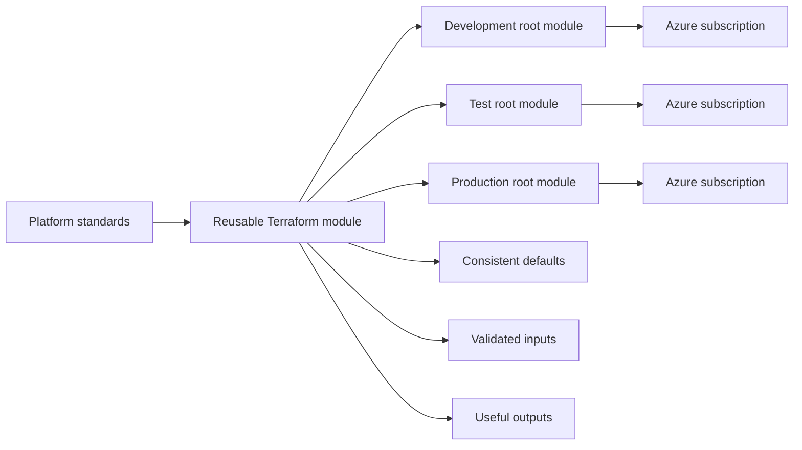
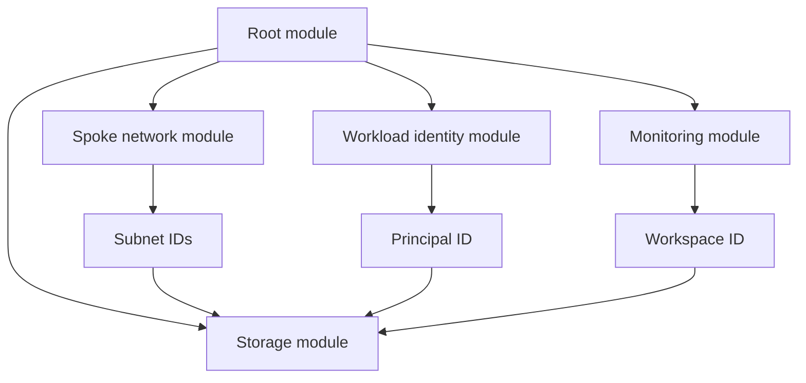
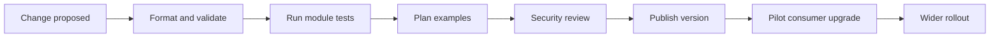
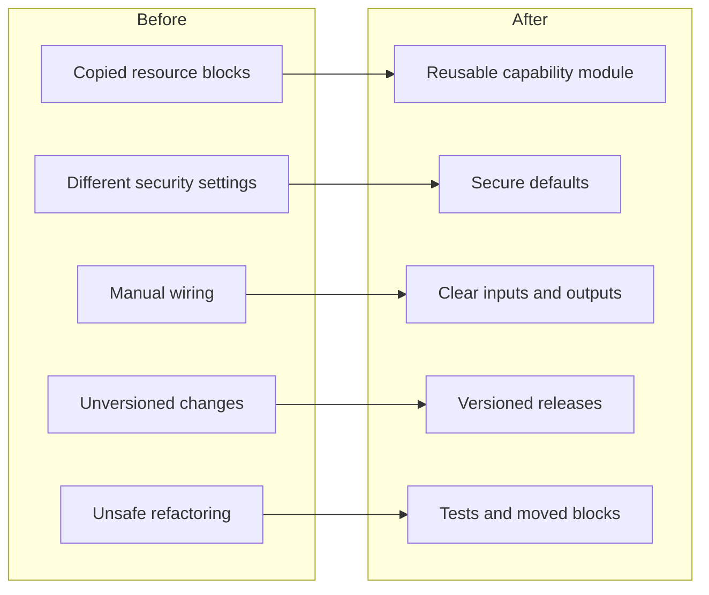

You create a Terraform module for an Azure Storage Account, publish it internally and proudly point three teams towards it. Within a month, one team needs private endpoints, another needs customer-managed keys, and a third wants public access because its application apparently still lives in 2014.

The module grows. You add more variables, optional blocks and conditional resources until it can support almost anything, provided nobody asks how it works.

That is the uncomfortable truth about reusable Terraform modules: **reuse does not come from exposing every possible option**. It comes from defining a stable contract that supports a clear set of use cases.

When I have led Terraform design across enterprise Azure Landing Zones, the most successful modules have not been the most configurable. They have been predictable, opinionated and small enough that engineers can understand the resulting plan.

This article covers how to choose the right abstraction, design useful inputs and outputs, support multiple Azure environments, apply secure defaults and evolve modules without breaking every workload that consumes them.



## Reuse a capability, not a resource block

Terraform already gives you reusable resource types through providers. Wrapping every Azure resource in a module does not automatically improve anything.

A module that accepts every argument from `azurerm_storage_account` and passes them straight through has created another interface without adding much value. The caller still needs to understand the full AzureRM resource, plus your naming choices and variable structure.

A reusable module should package a recognisable capability. For example:

* A private Storage Account with diagnostics and lifecycle protection
* A spoke virtual network with standard subnets and route associations
* An application identity with scoped role assignments
* A workload resource group with tags, locks and cost controls
* A private endpoint with the required DNS integration

HashiCorp recommends modules when you repeatedly deploy collections of resources with similar configurations. Modules communicate through explicit inputs and outputs, allowing callers to compose larger configurations whilst keeping implementation details separate.

### Draw the boundary around ownership

Resources inside a module should normally share an owner and lifecycle.

Your central networking team might own hub connectivity, route tables and private DNS zones. A workload team may own its spoke network, private endpoints and application resources. Combining all of that into one module means routine application changes can produce plans across shared platform infrastructure.

I have seen a Landing Zone module manage management groups, policies, networking, logging and workload onboarding from one state file. It was reusable in the same way a Swiss Army knife is reusable, although considerably less pleasant when opened incorrectly.

Microsoft’s current Azure Landing Zone Terraform approach also uses a more modular model, partly to let organisations select only the components they need and allow different teams to manage separate platform areas.

Keep the module tree relatively flat:



The root module should compose the capabilities. Avoid hiding several layers of child modules unless the nested module represents an implementation detail that callers genuinely should not manage.

## Design a clear and stable interface

Variables and outputs form your module’s public contract. Changing them can affect every consuming configuration, even when the underlying Azure resources stay exactly the same.

Start with strongly typed inputs:

```hcl id="2fs02h"
variable "storage_account" {
  description = "Configuration for the workload storage account."

  type = object({
    name                = string
    resource_group_name = string
    location            = string

    replication_type = optional(string, "ZRS")

    private_endpoint = optional(object({
      subnet_id           = string
      private_dns_zone_id = string
    }))
  })

  validation {
    condition = contains(
      ["LRS", "ZRS", "GRS", "GZRS"],
      var.storage_account.replication_type
    )

    error_message = "Replication type must be LRS, ZRS, GRS or GZRS."
  }
}
```

This interface supports one clear optional capability: a private endpoint. It does not expose five loosely related Boolean switches controlling the endpoint, DNS record and network interface separately.

Terraform evaluates variable validation during planning and stops when an input fails the declared condition. That lets your module reject unsupported configurations before Azure receives them.

### Prefer meaningful configuration over provider-shaped inputs

Your input should express what the caller wants, not mirror every field in the provider.

For example, this makes the caller understand your platform design:

```hcl id="dsg4tr"
module "storage" {
  source  = "app.terraform.io/rawritscloud/storage/azurerm"
  version = "3.2.0"

  storage_account = {
    name                = "stordersproduks01"
    resource_group_name = azurerm_resource_group.workload.name
    location            = "uksouth"
    replication_type    = "ZRS"

    private_endpoint = {
      subnet_id           = module.spoke_network.subnet_ids["private-endpoints"]
      private_dns_zone_id = var.blob_private_dns_zone_id
    }
  }

  log_analytics_workspace_id = var.log_analytics_workspace_id
  tags                       = local.tags
}
```

The caller chooses the name, location, resilience level and network integration. The module handles diagnostic settings, secure transport, public access and resource wiring.

That is an abstraction. Passing through forty provider arguments is administrative forwarding.

### Use defaults carefully

Defaults should represent the normal platform position, not hide an important decision.

Using `ZRS` as a default may make sense when your platform normally needs zone-level resilience. Defaulting production backup retention to seven days because nobody supplied a value is considerably harder to defend.

I use defaults for low-risk, predictable behaviour:

* Enabling diagnostics
* Disabling public access
* Enforcing TLS 1.2 or later
* Applying standard tags
* Enabling soft delete or versioning

I require explicit values for decisions with significant cost, availability or security consequences.

## Keep secure behaviour inside the module

A reusable module distributes decisions across your organisation. If the default is insecure, you have simply automated the problem efficiently.

A Storage Account module might enforce these baseline controls:

```hcl id="1vjsco"
resource "azurerm_storage_account" "this" {
  name                     = var.storage_account.name
  resource_group_name      = var.storage_account.resource_group_name
  location                 = var.storage_account.location
  account_tier             = "Standard"
  account_replication_type = var.storage_account.replication_type

  public_network_access_enabled   = false
  allow_nested_items_to_be_public = false
  shared_access_key_enabled       = false
  min_tls_version                 = "TLS1_2"

  identity {
    type = "SystemAssigned"
  }

  blob_properties {
    versioning_enabled = true

    delete_retention_policy {
      days = 14
    }

    container_delete_retention_policy {
      days = 14
    }
  }

  tags = local.tags
}
```

The module does not ask whether callers would prefer anonymous blob access or old TLS versions. Those are not workload customisations.

Where exceptions exist, make them explicit and difficult to use accidentally. You might require a separate exception module, an Azure Policy exemption or a clearly named variable such as `allow_public_network_access_exception`.

Do not call it `enable_public_access`. That makes a security exception look like a normal feature toggle.

### Avoid passing secrets through modules

Module variables make configuration reusable, but they do not turn Terraform state into a secret-management service.

Prefer managed identities and workload identity federation over passwords or client secrets. Where a module must accept sensitive data, mark the variable as sensitive and ensure the state backend has appropriate access controls.

The sensitive flag reduces accidental display in normal output. It does not prevent Terraform from storing the value in state.

Your module should usually accept a Key Vault secret identifier rather than the secret value itself:

```hcl id="ny14yb"
variable "database_password_secret_id" {
  description = "Resource ID of the Key Vault secret containing the database password."
  type        = string
  default     = null
}
```

Better still, design the Azure resources to authenticate through identity rather than passing a password around wearing a small `sensitive` label as camouflage.

## Make modules reusable across subscriptions

Enterprise Azure environments regularly use separate subscriptions for connectivity, identity, management and workloads. A reusable module must not assume that every related resource lives in the same subscription.

Provider configurations belong in the root module. Reusable child modules should declare provider requirements but should not contain their own configured `provider` blocks. Terraform can inherit a default provider or receive an aliased configuration through the module’s `providers` argument.

Configure aliases in the root:

```hcl id="gip6vo"
provider "azurerm" {
  subscription_id = var.workload_subscription_id

  features {}
}

provider "azurerm" {
  alias           = "connectivity"
  subscription_id = var.connectivity_subscription_id

  features {}
}
```

Pass the required provider to the relevant module:

```hcl id="0qt2pi"
module "private_dns_link" {
  source  = "app.terraform.io/rawritscloud/private-dns-link/azurerm"
  version = "1.4.0"

  providers = {
    azurerm = azurerm.connectivity
  }

  private_dns_zone_id = var.private_dns_zone_id
  virtual_network_id  = module.spoke_network.virtual_network_id
}
```

This keeps subscription selection visible in the root configuration. The module does not silently choose where resources should exist.

For a module that genuinely needs two AzureRM configurations, declare configuration aliases:

```hcl id="97jjz2"
terraform {
  required_providers {
    azurerm = {
      source = "hashicorp/azurerm"

      configuration_aliases = [
        azurerm.workload,
        azurerm.connectivity
      ]
    }
  }
}
```

Use this sparingly. A module requiring several providers often crosses ownership boundaries and may need splitting.

## Publish, test and evolve modules safely

A reusable module is a product, even when its customers sit three desks away.

It needs documentation, examples, automated tests, release notes and versions. Without those, consumers either pin an old release forever or track your main branch and discover breaking changes during a production deployment.

I normally use this structure:

```text id="vr45ic"
terraform-azurerm-private-storage/
├── examples/
│   ├── basic/
│   └── private-endpoint/
├── tests/
│   └── storage.tftest.hcl
├── main.tf
├── variables.tf
├── outputs.tf
├── locals.tf
├── versions.tf
├── README.md
└── CHANGELOG.md
```

Terraform’s test framework supports `run` blocks and assertions, allowing you to test module behaviour rather than only checking syntax.

```hcl id="y29b3p"
mock_provider "azurerm" {}

run "secure_defaults" {
  command = plan

  variables {
    storage_account = {
      name                = "strawritscloudtest01"
      resource_group_name = "rg-module-test-uks"
      location            = "uksouth"
    }

    log_analytics_workspace_id = "/subscriptions/00000000-0000-0000-0000-000000000000/resourceGroups/rg-monitoring/providers/Microsoft.OperationalInsights/workspaces/log-test"
  }

  assert {
    condition = (
      azurerm_storage_account.this.public_network_access_enabled == false
    )

    error_message = "The module must disable public network access."
  }

  assert {
    condition = (
      azurerm_storage_account.this.shared_access_key_enabled == false
    )

    error_message = "The module must disable shared key access."
  }
}
```

Test the examples as well as the module internals. Examples represent how consumers actually call the module, so they often catch interface problems that isolated tests miss.

### Preserve the upgrade path

Renaming a resource changes its Terraform address. Without guidance, Terraform may interpret the change as a request to destroy the original resource and create another one.

Use `moved` blocks when refactoring:

```hcl id="x2mb5g"
moved {
  from = azurerm_storage_account.storage
  to   = azurerm_storage_account.this
}
```

Terraform uses the block to associate the existing state object with its new address without destroying it. HashiCorp recommends retaining historical moved blocks because removing them can break upgrades for consumers coming from older module releases.

Follow semantic versioning:

* Patch versions for fixes that do not change the public contract
* Minor versions for backwards-compatible features
* Major versions for breaking input, output or behaviour changes

Pin module versions in production root modules. A registry module without a version constraint is less reuse and more subscription-based suspense.



Before building your own module, check whether an Azure Verified Module already meets the requirement. Microsoft maintains AVMs as reusable Terraform and Bicep building blocks, with defined design, testing and documentation standards.

You may still need a small wrapper to apply your organisation’s conventions. That is usually easier to maintain than recreating the entire Azure resource module.



## Common Mistakes

**Exposing every provider argument.** Decide what your platform supports and present a smaller interface. Do not rebuild the AzureRM documentation as variables.

**Making the module responsible for several teams’ resources.** Split modules around ownership and lifecycle so workload changes do not plan central platform infrastructure.

**Using Boolean flags for complex features.** Use optional objects that contain the complete configuration for private endpoints, diagnostics or customer-managed keys.

**Publishing from the main branch.** Release versioned modules and pin those versions in consuming configurations.

**Refactoring without `moved` blocks.** Preserve resource addresses during upgrades instead of asking every consumer to repair state manually.

## Summary

Reusable Terraform modules work when they package a clear Azure capability behind a stable, deliberate contract.

Keep module boundaries aligned with resource ownership and lifecycle. Use typed inputs, sensible validation and secure defaults rather than exposing every provider option.

Let root modules compose capabilities and choose subscriptions through provider configurations. Test the module and its examples, publish versioned releases and preserve existing state addresses with `moved` blocks when you refactor.

The aim is not to support every imaginable deployment. It is to make the approved deployment easy, the unsafe deployment difficult and future changes predictable enough that engineers will actually upgrade.

## What to Explore Next

* Read [Terraform Locals: Cleaner Code Without the Clutter](/terraform-locals-cleaner-code-without-the-clutter/) for normalising module inputs.
* Review [Azure RBAC: Getting Role Assignments Right](/azure-rbac-getting-role-assignments-right/) before adding access control to reusable modules.
* Explore [Azure Policy Explained](/azure-policy-explained/) to enforce controls that should not depend entirely on module adoption.
* Compare your design with Azure Verified Modules before building another internal module from scratch.

Connect with me on [LinkedIn](https://www.linkedin.com/in/jrmurray86/), explore practical Terraform examples in the [RAWRitsCloud GitHub repository](https://github.com/RAWRitsCloud), and continue through the related Azure and Terraform articles on RAWRitsCloud.
