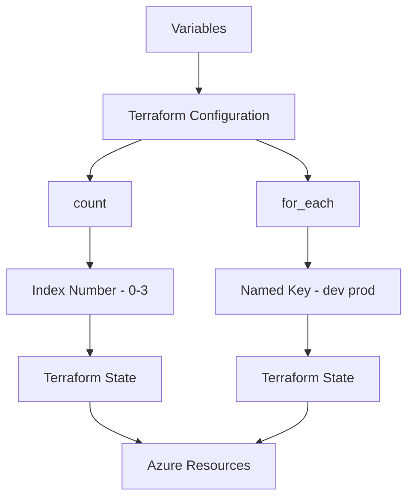
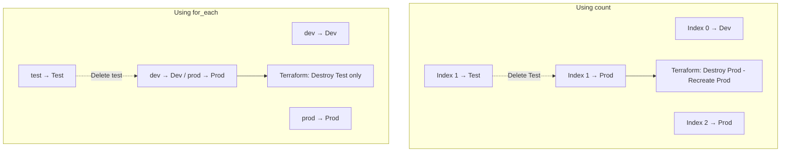
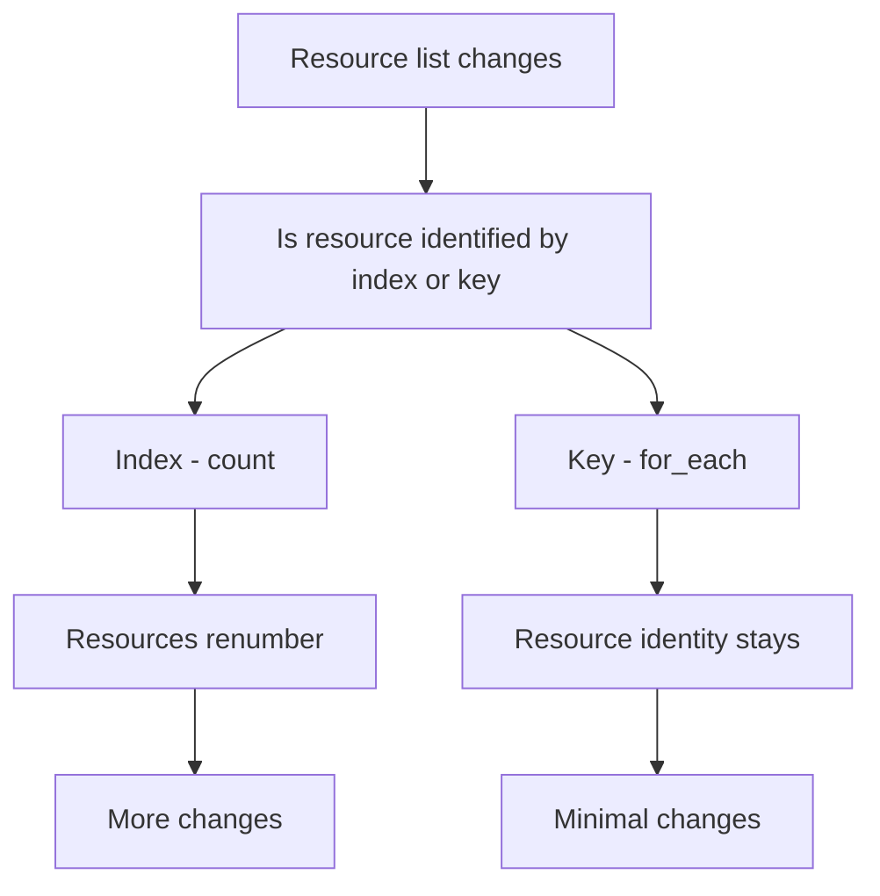

# Terraform for_each vs count

If you've ever added a VM to a Terraform deployment only to discover Terraform wants to destroy perfectly healthy resources, you've probably met the downside of `count`.

It usually starts innocently enough. You have a handful of storage accounts, virtual networks or resource groups, so you use `count` because it's quick and easy. Then someone asks you to remove the second item from the list. Suddenly Terraform decides resource number three should become resource number two, number four should become number three, and before you know it your plan looks more like a demolition schedule than a routine update.

I've wasted a good afternoon trying to work out why Terraform wanted to replace resources that hadn't actually changed. The answer almost always came back to how those resources were identified.

This is one of those Terraform concepts that looks simple until you're maintaining infrastructure over several years instead of several days.

In this article I'll explain exactly how `count` and `for_each` work, when each one makes sense, where they regularly catch engineers out, and how I approach the decision when designing Azure Landing Zone deployments.

---

## Why this matters more than you think

At first glance both options appear to solve exactly the same problem.

They both allow you to create multiple resources without copying the same block over and over again.

The difference isn't how many resources they create.

The difference is **how Terraform tracks them over time.**

That's a surprisingly important distinction.

In enterprise Azure environments resources rarely stay static. Teams add subscriptions. Applications appear. Business units disappear. Landing Zones evolve.

Your Terraform configuration needs to evolve with them without recreating infrastructure every few weeks.

That is where choosing the right iteration method becomes important.

---

# High-Level Architecture


---

## Understanding `count`

`count` is based entirely on numbers.

Terraform simply creates resources from zero upwards.

```hcl
variable "resource_groups" {
  default = [
    "rg-dev",
    "rg-test",
    "rg-prod"
  ]
}

resource "azurerm_resource_group" "rg" {
  count = length(var.resource_groups)

  name     = var.resource_groups[count.index]
  location = "UK South"
}
```

Terraform creates:

| Index | Resource |
|-------:|----------|
| 0 | rg-dev |
| 1 | rg-test |
| 2 | rg-prod |

Nice and straightforward.

Until someone removes **rg-test**.

Terraform now sees:

| Index | Resource |
|-------:|----------|
| 0 | rg-dev |
| 1 | rg-prod |

Unfortunately `rg-prod` used to be index 2.

Terraform doesn't know you've simply removed one item.

It thinks **index 1 has changed**, so it plans to destroy one resource and recreate another.

If those resources contain stateful services, you've just turned a five-minute change into an uncomfortable CAB meeting.

---

## Understanding `for_each`

`for_each` approaches the problem differently.

Instead of numbering resources, Terraform gives each one a permanent key.

```hcl
variable "resource_groups" {
  default = {
    dev  = "rg-dev"
    test = "rg-test"
    prod = "rg-prod"
  }
}

resource "azurerm_resource_group" "rg" {
  for_each = var.resource_groups

  name     = each.value
  location = "UK South"
}
```

Terraform now creates:

| Key | Resource |
|-----|----------|
| dev | rg-dev |
| test | rg-test |
| prod | rg-prod |

If you remove `test`, only that single resource changes.

The others remain exactly where they are because their identity hasn't changed.

That's why `for_each` is generally the better choice for long-lived Azure environments.

I've found this especially valuable when deploying management groups, subscriptions, networking, RBAC assignments and policy initiatives. These are resources you really don't want Terraform trying to shuffle around because someone deleted item number two from a list.

---

## Choosing the right option

There's a temptation online to say "always use `for_each`."

I don't think that's quite right.

Both have legitimate uses.

| Use Case | count | for_each |
|-----------|:-----:|:--------:|
| Enable or disable one resource | ✅ | ❌ |
| Fixed identical resources | ✅ | ✅ |
| Named infrastructure | ❌ | ✅ |
| Enterprise Azure deployments | ❌ | ✅ |
| Long-term maintainability | ❌ | ✅ |

A classic use for `count` is conditional deployment.

```hcl
variable "enable_bastion" {
  default = true
}

resource "azurerm_public_ip" "bastion" {
  count = var.enable_bastion ? 1 : 0

  name                = "pip-bastion"
  resource_group_name = azurerm_resource_group.network.name
  location            = azurerm_resource_group.network.location
  allocation_method   = "Static"
  sku                 = "Standard"
}
```

That's simple.

You're either creating one resource or none.

No indexing problems because there is only ever one object.

Once you're managing collections of resources with meaningful identities, I switch to `for_each` almost automatically.

---

## Real-world Azure example

Imagine you're deploying resource groups for multiple application teams.

Instead of writing this:

```hcl
variable "teams" {
  default = [
    "Finance",
    "HR",
    "Sales"
  ]
}
```

I'd usually define something closer to this:

```hcl
variable "teams" {
  default = {
    finance = {
      location = "UK South"
    }

    hr = {
      location = "UK West"
    }

    sales = {
      location = "North Europe"
    }
  }
}

resource "azurerm_resource_group" "team" {
  for_each = var.teams

  name     = "rg-${each.key}"
  location = each.value.location
}
```

Now every resource has a permanent identity.

Adding Marketing next month doesn't affect Finance.

Removing HR doesn't recreate Sales.

Your Terraform state remains predictable, which is exactly what you want when several engineers contribute to the same repository.

---

## Before vs After



---

## Process Flow



---

## Security and operational considerations

Neither option is more secure than the other, but operationally they behave very differently.

Predictable infrastructure means predictable change windows.

When Terraform plans to recreate resources unnecessarily, engineers become reluctant to apply changes. That often leads to larger, riskier deployments because small improvements keep getting postponed.

State stability is one of those things nobody notices until it disappears.

If you're working with production subscriptions, management groups, networking or role assignments, reducing unnecessary churn should be a priority.

---

## Common mistakes

The biggest mistake is assuming `count` and `for_each` are interchangeable. They aren't. They produce similar results initially but behave very differently as your environment evolves.

Another common issue is using lists with `count` for resources that already have unique names. If the resources naturally have identities, model them that way with a map and `for_each`.

Avoid converting between `count` and `for_each` halfway through a project unless you've planned the state migration. Terraform sees them as different resource addresses, so changing from one to the other without using `terraform state mv` or moved blocks can result in unnecessary resource replacement.

Finally, don't make your keys unstable. Keys like `dev`, `prod` or `finance` are great. Keys generated from random values or changing strings are asking for trouble.

---

## Summary

`count` is excellent when you're creating a simple fixed number of identical resources or conditionally deploying something once. Beyond that, its reliance on numeric indexes becomes a maintenance problem.

`for_each` gives every resource a stable identity, making Terraform plans far more predictable as Azure environments grow and change. That's why you'll see it used extensively in well-designed enterprise modules.

If I'm deploying Azure Landing Zones, management groups, RBAC assignments, networking or subscription-level resources, I almost always reach for `for_each`. It makes future changes easier, reduces unnecessary churn and gives me far more confidence before pressing **Apply**.

---

## What to Explore Next

- **Terraform Locals: Cleaner Code Without the Clutter**
- **Azure Policy Explained**
- **Azure RBAC: Getting Role Assignments Right**
- Explore Terraform **moved** blocks for safely refactoring existing infrastructure.
- Review the Azure Verified Modules to see how Microsoft uses `for_each` in production-ready Terraform modules.

---

## Final thoughts

One of the things I enjoy about Terraform is that the biggest lessons often aren't about syntax. They're about understanding how Terraform thinks.

Choosing between `count` and `for_each` isn't about writing fewer lines of code. It's about making life easier for the person maintaining that code six months from now. Quite often, that person is you.

If you've found this useful, have a look around the rest of **RAWRitsCloud** for more Azure and Terraform articles. You can also connect with me on LinkedIn, explore my GitHub repositories, or get in touch if you've found an interesting Terraform edge case—I seem to collect those.