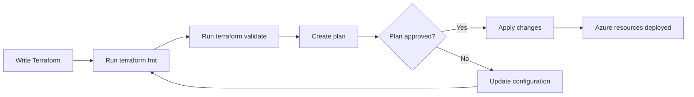

---

layout: post
title: "Testing Mermaid Charts on RAWRitsCloud"
date: 2026-07-21 00:00:00 +0000
categories: [Testing]
tags: [Mermaid, Jekyll, GitHub Pages]
author: james
excerpt: "A short test post to confirm that Mermaid diagrams render correctly on the RAWRitsCloud blog."
---

This is a short test article to confirm that Mermaid diagrams render correctly on the RAWRitsCloud blog.

The chart below represents a basic Terraform deployment process. If Mermaid support works correctly, you should see a flow diagram rather than a code block.

## Terraform Deployment Flow

## Expected Result

The diagram should show the following process:

1. Write the Terraform configuration.
2. Format and validate the code.
3. Create and review the Terraform plan.
4. Apply approved changes to Azure.
5. Return to the configuration when the plan needs changes.

If you can see a formatted flow chart above, Mermaid rendering is working. If you can only see the source text, the blog still needs Mermaid initialisation or a compatible Markdown rendering plugin.

A small test post is considerably easier to troubleshoot than discovering broken diagrams after publishing a 2,000-word article. Progress through controlled disappointment.
